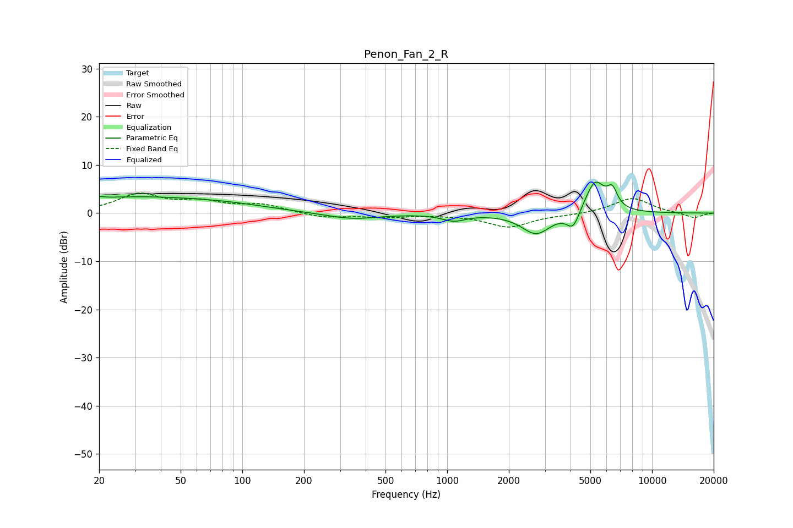

# Penon_Fan_2_R
See [usage instructions](https://github.com/jaakkopasanen/AutoEq#usage) for more options and info.

### Parametric EQs
Apply preamp of -6.5 dB when using parametric equalizer.

|   # | Type    |   Fc (Hz) |    Q |   Gain (dB) |
|-----|---------|-----------|------|-------------|
|   1 | Peaking |        20 | 5.97 |         3.2 |
|   2 | Peaking |        20 | 5.99 |        -2.8 |
|   3 | Peaking |        28 | 0.38 |         3.1 |
|   4 | Peaking |        86 | 0.67 |         1   |
|   5 | Peaking |       343 | 1.07 |        -1.3 |
|   6 | Peaking |      1078 | 2.47 |        -1.4 |
|   7 | Peaking |      2721 | 1.98 |        -4.4 |
|   8 | Peaking |      4120 | 4.4  |        -3.7 |
|   9 | Peaking |      5265 | 2.79 |         6.9 |
|  10 | Peaking |      6396 | 5.56 |         3.5 |

### Fixed Band EQs
When using fixed band (also called graphic) equalizer, apply preamp of **-4.2 dB** (if available) and set gains manually with these parameters.

|   # | Type    |   Fc (Hz) |    Q |   Gain (dB) |
|-----|---------|-----------|------|-------------|
|   1 | Peaking |        31 | 1.41 |         3.7 |
|   2 | Peaking |        62 | 1.41 |         2   |
|   3 | Peaking |       125 | 1.41 |         1.6 |
|   4 | Peaking |       250 | 1.41 |        -1   |
|   5 | Peaking |       500 | 1.41 |        -0.8 |
|   6 | Peaking |      1000 | 1.41 |        -0.2 |
|   7 | Peaking |      2000 | 1.41 |        -2.9 |
|   8 | Peaking |      4000 | 1.41 |        -0.3 |
|   9 | Peaking |      8000 | 1.41 |         3.2 |
|  10 | Peaking |     16000 | 1.41 |        -1.1 |

### Graphs

