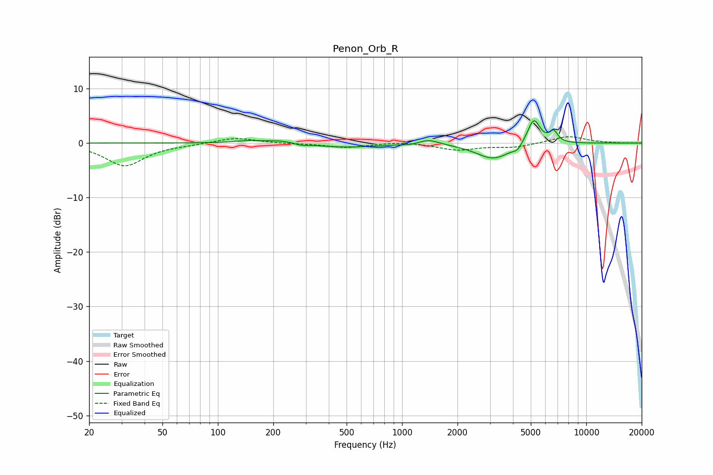

# Penon_Orb_R
See [usage instructions](https://github.com/jaakkopasanen/AutoEq#usage) for more options and info.

### Parametric EQs
Apply preamp of -4.2 dB when using parametric equalizer.

|   # | Type    |   Fc (Hz) |    Q |   Gain (dB) |
|-----|---------|-----------|------|-------------|
|   1 | Peaking |       143 | 1.9  |         0.4 |
|   2 | Peaking |       222 | 1.47 |         0.6 |
|   3 | Peaking |       282 | 4.08 |        -0.4 |
|   4 | Peaking |       477 | 0.74 |        -0.8 |
|   5 | Peaking |      1132 | 2.97 |        -0.2 |
|   6 | Peaking |      1387 | 2.47 |         1   |
|   7 | Peaking |      3145 | 1.49 |        -2.9 |
|   8 | Peaking |      4231 | 6    |        -0.9 |
|   9 | Peaking |      5187 | 3.98 |         4.8 |
|  10 | Peaking |      6646 | 5.99 |         2   |

### Fixed Band EQs
When using fixed band (also called graphic) equalizer, apply preamp of **-1.2 dB** (if available) and set gains manually with these parameters.

|   # | Type    |   Fc (Hz) |    Q |   Gain (dB) |
|-----|---------|-----------|------|-------------|
|   1 | Peaking |        31 | 1.41 |        -4.2 |
|   2 | Peaking |        62 | 1.41 |        -0.2 |
|   3 | Peaking |       125 | 1.41 |         1   |
|   4 | Peaking |       250 | 1.41 |        -0.1 |
|   5 | Peaking |       500 | 1.41 |        -0.8 |
|   6 | Peaking |      1000 | 1.41 |         0.3 |
|   7 | Peaking |      2000 | 1.41 |        -1.2 |
|   8 | Peaking |      4000 | 1.41 |        -0.7 |
|   9 | Peaking |      8000 | 1.41 |         1.3 |
|  10 | Peaking |     16000 | 1.41 |        -0   |

### Graphs

