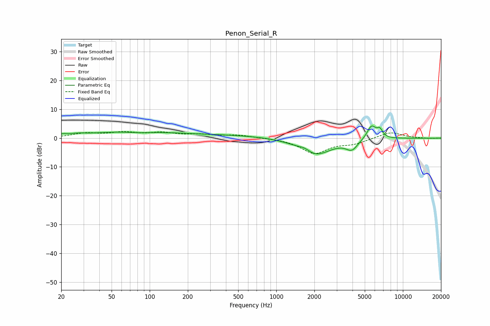

# Penon_Serial_R
See [usage instructions](https://github.com/jaakkopasanen/AutoEq#usage) for more options and info.

### Parametric EQs
Apply preamp of -4.3 dB when using parametric equalizer.

|   # | Type    |   Fc (Hz) |    Q |   Gain (dB) |
|-----|---------|-----------|------|-------------|
|   1 | Peaking |        21 | 5.99 |         0.5 |
|   2 | Peaking |        26 | 1.93 |         0.7 |
|   3 | Peaking |        70 | 0.54 |         1.9 |
|   4 | Peaking |        80 | 1.03 |        -1   |
|   5 | Peaking |       221 | 0.19 |         1.2 |
|   6 | Peaking |      1677 | 2.88 |         1.4 |
|   7 | Peaking |      2007 | 1.11 |        -6.2 |
|   8 | Peaking |      3950 | 3.09 |        -3.2 |
|   9 | Peaking |      5643 | 3.8  |         4.8 |
|  10 | Peaking |      6571 | 6    |         2.6 |

### Fixed Band EQs
When using fixed band (also called graphic) equalizer, apply preamp of **-2.4 dB** (if available) and set gains manually with these parameters.

|   # | Type    |   Fc (Hz) |    Q |   Gain (dB) |
|-----|---------|-----------|------|-------------|
|   1 | Peaking |        31 | 1.41 |         1.5 |
|   2 | Peaking |        62 | 1.41 |         1.7 |
|   3 | Peaking |       125 | 1.41 |         1.6 |
|   4 | Peaking |       250 | 1.41 |         1   |
|   5 | Peaking |       500 | 1.41 |         1   |
|   6 | Peaking |      1000 | 1.41 |         0   |
|   7 | Peaking |      2000 | 1.41 |        -5.2 |
|   8 | Peaking |      4000 | 1.41 |        -1.7 |
|   9 | Peaking |      8000 | 1.41 |         2.2 |
|  10 | Peaking |     16000 | 1.41 |        -0.1 |

### Graphs

