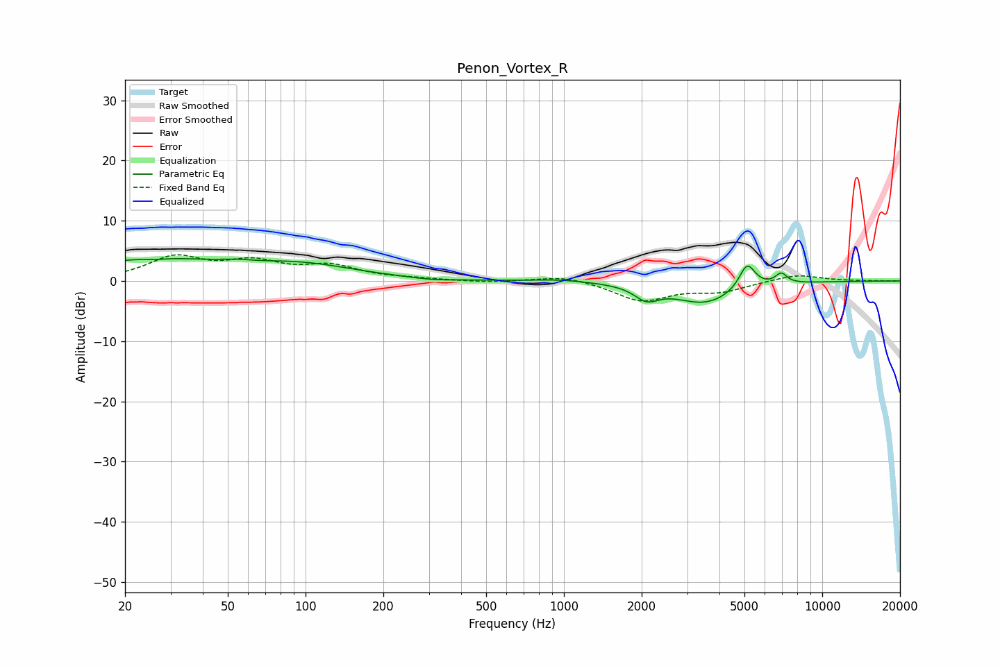

# Penon_Vortex_R
See [usage instructions](https://github.com/jaakkopasanen/AutoEq#usage) for more options and info.

### Parametric EQs
Apply preamp of -3.8 dB when using parametric equalizer.

|   # | Type    |   Fc (Hz) |    Q |   Gain (dB) |
|-----|---------|-----------|------|-------------|
|   1 | Peaking |        25 | 0.49 |         3.4 |
|   2 | Peaking |        26 | 3.48 |        -0.2 |
|   3 | Peaking |        53 | 2.95 |         0.3 |
|   4 | Peaking |        98 | 0.67 |         2.3 |
|   5 | Peaking |       313 | 1.75 |        -0.3 |
|   6 | Peaking |       967 | 1.42 |         0.4 |
|   7 | Peaking |      2091 | 3.07 |        -2.2 |
|   8 | Peaking |      3519 | 1.17 |        -3.7 |
|   9 | Peaking |      5121 | 4.44 |         4.3 |
|  10 | Peaking |      6936 | 6    |         1.7 |

### Fixed Band EQs
When using fixed band (also called graphic) equalizer, apply preamp of **-4.4 dB** (if available) and set gains manually with these parameters.

|   # | Type    |   Fc (Hz) |    Q |   Gain (dB) |
|-----|---------|-----------|------|-------------|
|   1 | Peaking |        31 | 1.41 |         3.7 |
|   2 | Peaking |        62 | 1.41 |         2.7 |
|   3 | Peaking |       125 | 1.41 |         2.2 |
|   4 | Peaking |       250 | 1.41 |         0.3 |
|   5 | Peaking |       500 | 1.41 |        -0.3 |
|   6 | Peaking |      1000 | 1.41 |         1   |
|   7 | Peaking |      2000 | 1.41 |        -3.2 |
|   8 | Peaking |      4000 | 1.41 |        -1.6 |
|   9 | Peaking |      8000 | 1.41 |         1.1 |
|  10 | Peaking |     16000 | 1.41 |         0   |

### Graphs

