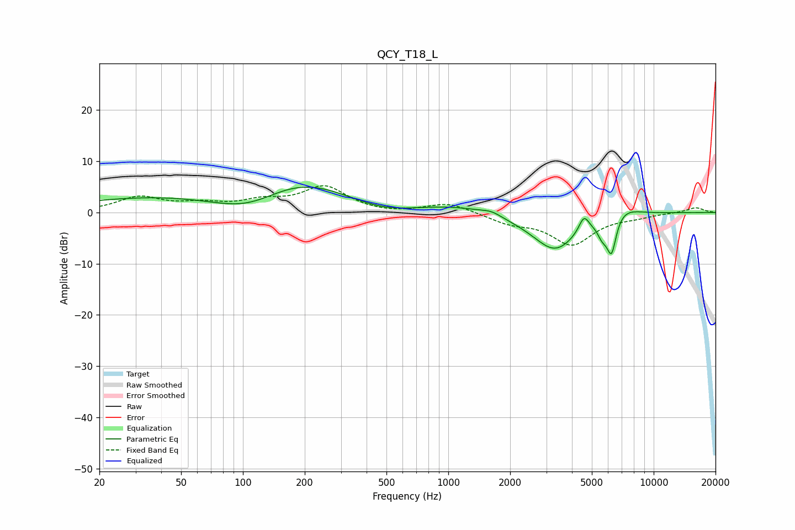

# QCY_T18_L
See [usage instructions](https://github.com/jaakkopasanen/AutoEq#usage) for more options and info.

### Parametric EQs
Apply preamp of -5.0 dB when using parametric equalizer.

|   # | Type    |   Fc (Hz) |    Q |   Gain (dB) |
|-----|---------|-----------|------|-------------|
|   1 | Peaking |       109 | 0.43 |       -14.7 |
|   2 | Peaking |       169 | 0.24 |        20   |
|   3 | Peaking |       475 | 0.52 |        -8.2 |
|   4 | Peaking |      1620 | 3.06 |         0.7 |
|   5 | Peaking |      2046 | 0.91 |        -0.8 |
|   6 | Peaking |      3309 | 1.23 |        -7.6 |
|   7 | Peaking |      4575 | 5.65 |         3.1 |
|   8 | Peaking |      5617 | 5.66 |        -2.6 |
|   9 | Peaking |      6234 | 5.58 |        -7.6 |
|  10 | Peaking |      6851 | 1.67 |         2.3 |

### Fixed Band EQs
When using fixed band (also called graphic) equalizer, apply preamp of **-5.3 dB** (if available) and set gains manually with these parameters.

|   # | Type    |   Fc (Hz) |    Q |   Gain (dB) |
|-----|---------|-----------|------|-------------|
|   1 | Peaking |        31 | 1.41 |         2.9 |
|   2 | Peaking |        62 | 1.41 |         1.4 |
|   3 | Peaking |       125 | 1.41 |         1.8 |
|   4 | Peaking |       250 | 1.41 |         4.8 |
|   5 | Peaking |       500 | 1.41 |        -0.4 |
|   6 | Peaking |      1000 | 1.41 |         1.9 |
|   7 | Peaking |      2000 | 1.41 |        -1.8 |
|   8 | Peaking |      4000 | 1.41 |        -6.1 |
|   9 | Peaking |      8000 | 1.41 |        -0.6 |
|  10 | Peaking |     16000 | 1.41 |         1   |

### Graphs

