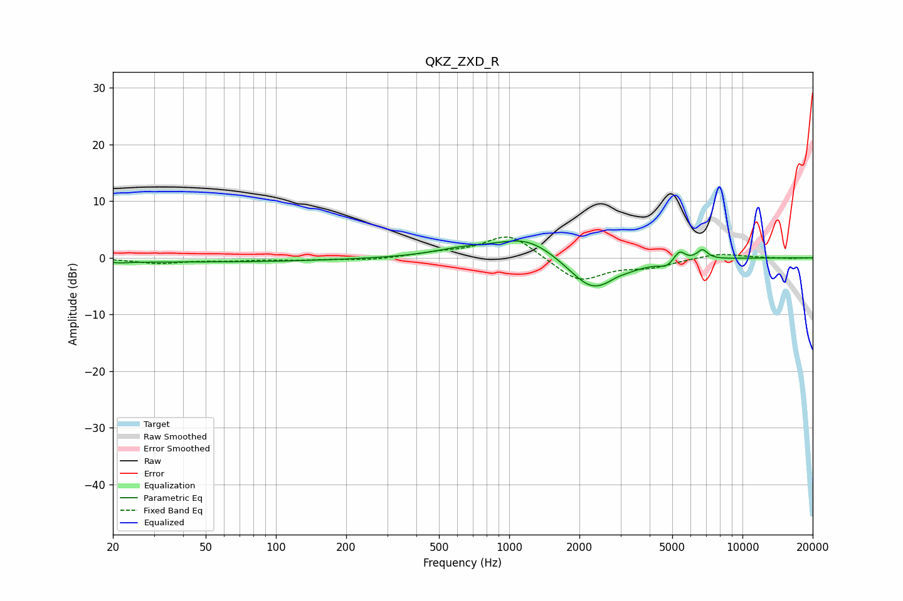

# QKZ_ZXD_R
See [usage instructions](https://github.com/jaakkopasanen/AutoEq#usage) for more options and info.

### Parametric EQs
Apply preamp of -3.1 dB when using parametric equalizer.

|   # | Type    |   Fc (Hz) |    Q |   Gain (dB) |
|-----|---------|-----------|------|-------------|
|   1 | Peaking |        22 | 4.44 |        -0.2 |
|   2 | Peaking |        36 | 0.18 |        -0.8 |
|   3 | Peaking |       630 | 1.13 |         1.1 |
|   4 | Peaking |      1205 | 1.05 |         3.9 |
|   5 | Peaking |      2238 | 1.9  |        -1.6 |
|   6 | Peaking |      2315 | 1.13 |        -4.8 |
|   7 | Peaking |      2894 | 4.82 |         0.3 |
|   8 | Peaking |      4704 | 4.89 |        -0.9 |
|   9 | Peaking |      5373 | 6    |         1.8 |
|  10 | Peaking |      6728 | 6    |         1.7 |

### Fixed Band EQs
When using fixed band (also called graphic) equalizer, apply preamp of **-3.8 dB** (if available) and set gains manually with these parameters.

|   # | Type    |   Fc (Hz) |    Q |   Gain (dB) |
|-----|---------|-----------|------|-------------|
|   1 | Peaking |        31 | 1.41 |        -0.9 |
|   2 | Peaking |        62 | 1.41 |        -0.4 |
|   3 | Peaking |       125 | 1.41 |        -0.3 |
|   4 | Peaking |       250 | 1.41 |        -0.4 |
|   5 | Peaking |       500 | 1.41 |         0.7 |
|   6 | Peaking |      1000 | 1.41 |         4.3 |
|   7 | Peaking |      2000 | 1.41 |        -4.3 |
|   8 | Peaking |      4000 | 1.41 |        -1.4 |
|   9 | Peaking |      8000 | 1.41 |         0.9 |
|  10 | Peaking |     16000 | 1.41 |        -0.1 |

### Graphs

