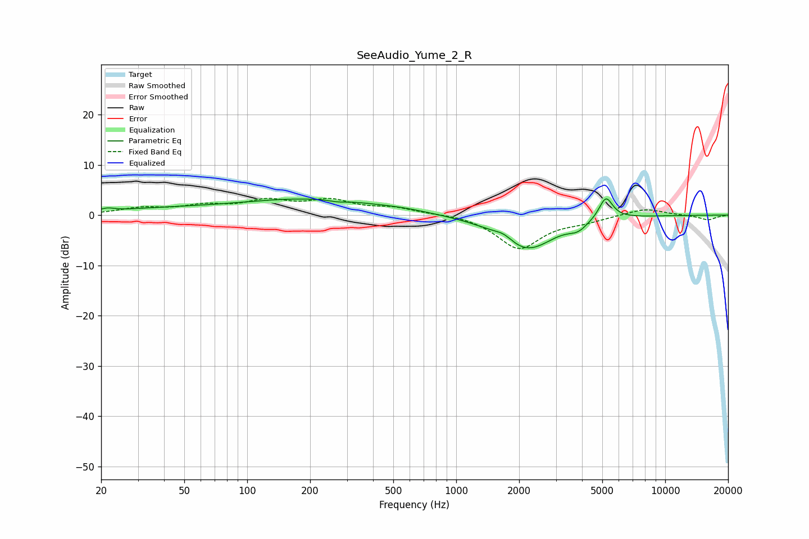

# SeeAudio_Yume_2_R
See [usage instructions](https://github.com/jaakkopasanen/AutoEq#usage) for more options and info.

### Parametric EQs
Apply preamp of -3.3 dB when using parametric equalizer.

|   # | Type    |   Fc (Hz) |    Q |   Gain (dB) |
|-----|---------|-----------|------|-------------|
|   1 | Peaking |        21 | 4.73 |         0.5 |
|   2 | Peaking |        38 | 0.49 |         1   |
|   3 | Peaking |       201 | 0.41 |         3.1 |
|   4 | Peaking |       271 | 3.42 |        -0.3 |
|   5 | Peaking |       555 | 1.25 |         0.3 |
|   6 | Peaking |      1692 | 3.08 |         1.3 |
|   7 | Peaking |      2119 | 1.09 |        -6.6 |
|   8 | Peaking |      2528 | 1.77 |        -0.6 |
|   9 | Peaking |      3824 | 3.14 |        -1.5 |
|  10 | Peaking |      5201 | 4.18 |         4.6 |

### Fixed Band EQs
When using fixed band (also called graphic) equalizer, apply preamp of **-3.4 dB** (if available) and set gains manually with these parameters.

|   # | Type    |   Fc (Hz) |    Q |   Gain (dB) |
|-----|---------|-----------|------|-------------|
|   1 | Peaking |        31 | 1.41 |         1.2 |
|   2 | Peaking |        62 | 1.41 |         1.6 |
|   3 | Peaking |       125 | 1.41 |         2.5 |
|   4 | Peaking |       250 | 1.41 |         2.6 |
|   5 | Peaking |       500 | 1.41 |         1.3 |
|   6 | Peaking |      1000 | 1.41 |         0.3 |
|   7 | Peaking |      2000 | 1.41 |        -6.6 |
|   8 | Peaking |      4000 | 1.41 |        -1   |
|   9 | Peaking |      8000 | 1.41 |         1.4 |
|  10 | Peaking |     16000 | 1.41 |        -1   |

### Graphs

