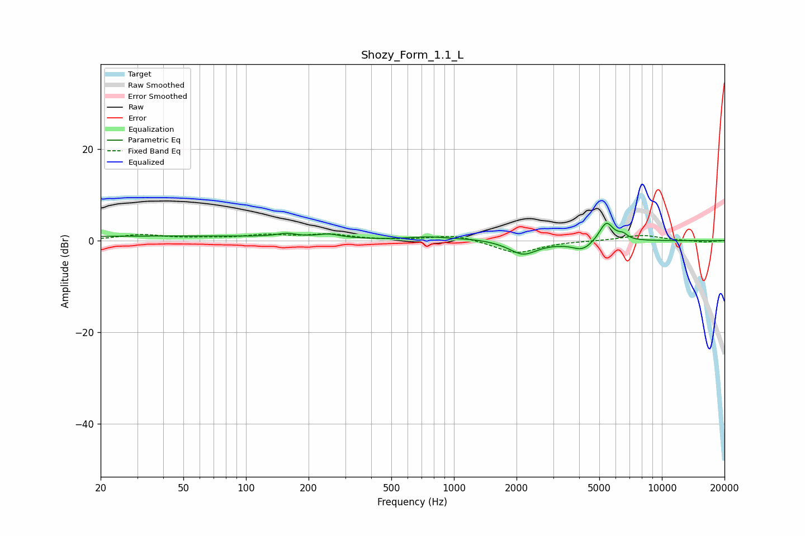

# Shozy_Form_1.1_L
See [usage instructions](https://github.com/jaakkopasanen/AutoEq#usage) for more options and info.

### Parametric EQs
Apply preamp of -3.9 dB when using parametric equalizer.

|   # | Type    |   Fc (Hz) |    Q |   Gain (dB) |
|-----|---------|-----------|------|-------------|
|   1 | Peaking |        43 | 0.18 |         1   |
|   2 | Peaking |       157 | 3.12 |         0.7 |
|   3 | Peaking |       250 | 2.59 |         0.8 |
|   4 | Peaking |       757 | 1.49 |         0.7 |
|   5 | Peaking |      1256 | 1.47 |         0.3 |
|   6 | Peaking |      2148 | 2.15 |        -2.9 |
|   7 | Peaking |      3175 | 1.31 |        -0.3 |
|   8 | Peaking |      4163 | 2.92 |        -1.9 |
|   9 | Peaking |      5408 | 4.11 |         4.3 |
|  10 | Peaking |      6491 | 6    |         1   |

### Fixed Band EQs
When using fixed band (also called graphic) equalizer, apply preamp of **-1.6 dB** (if available) and set gains manually with these parameters.

|   # | Type    |   Fc (Hz) |    Q |   Gain (dB) |
|-----|---------|-----------|------|-------------|
|   1 | Peaking |        31 | 1.41 |         1.2 |
|   2 | Peaking |        62 | 1.41 |         0.4 |
|   3 | Peaking |       125 | 1.41 |         1.1 |
|   4 | Peaking |       250 | 1.41 |         1.2 |
|   5 | Peaking |       500 | 1.41 |         0   |
|   6 | Peaking |      1000 | 1.41 |         1.3 |
|   7 | Peaking |      2000 | 1.41 |        -2.8 |
|   8 | Peaking |      4000 | 1.41 |        -0   |
|   9 | Peaking |      8000 | 1.41 |         1.2 |
|  10 | Peaking |     16000 | 1.41 |        -0.4 |

### Graphs

