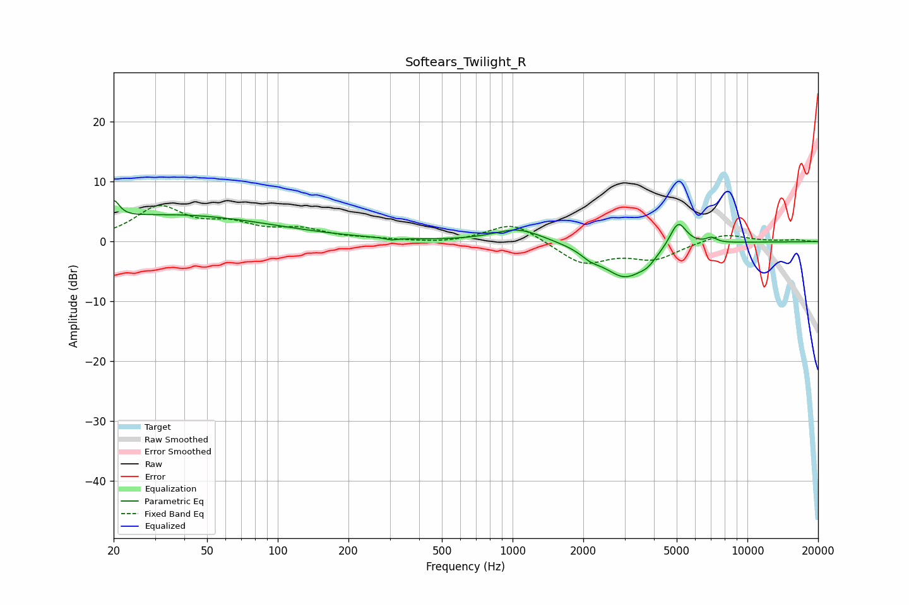

# Softears_Twilight_R
See [usage instructions](https://github.com/jaakkopasanen/AutoEq#usage) for more options and info.

### Parametric EQs
Apply preamp of -7.0 dB when using parametric equalizer.

|   # | Type    |   Fc (Hz) |    Q |   Gain (dB) |
|-----|---------|-----------|------|-------------|
|   1 | Peaking |        20 | 6    |         2.9 |
|   2 | Peaking |        34 | 0.32 |         4.4 |
|   3 | Peaking |       193 | 1.26 |         0   |
|   4 | Peaking |       304 | 5.97 |        -0.3 |
|   5 | Peaking |      1059 | 1.35 |         2.3 |
|   6 | Peaking |      2149 | 3.36 |        -1.1 |
|   7 | Peaking |      3016 | 1.48 |        -5.9 |
|   8 | Peaking |      3761 | 4.22 |        -1   |
|   9 | Peaking |      5067 | 3.86 |         4.4 |
|  10 | Peaking |      7027 | 6    |         0.8 |

### Fixed Band EQs
When using fixed band (also called graphic) equalizer, apply preamp of **-6.1 dB** (if available) and set gains manually with these parameters.

|   # | Type    |   Fc (Hz) |    Q |   Gain (dB) |
|-----|---------|-----------|------|-------------|
|   1 | Peaking |        31 | 1.41 |         5.5 |
|   2 | Peaking |        62 | 1.41 |         2.4 |
|   3 | Peaking |       125 | 1.41 |         1.8 |
|   4 | Peaking |       250 | 1.41 |         0.3 |
|   5 | Peaking |       500 | 1.41 |        -0.4 |
|   6 | Peaking |      1000 | 1.41 |         3.3 |
|   7 | Peaking |      2000 | 1.41 |        -3.7 |
|   8 | Peaking |      4000 | 1.41 |        -2.7 |
|   9 | Peaking |      8000 | 1.41 |         1.4 |
|  10 | Peaking |     16000 | 1.41 |         0.3 |

### Graphs

