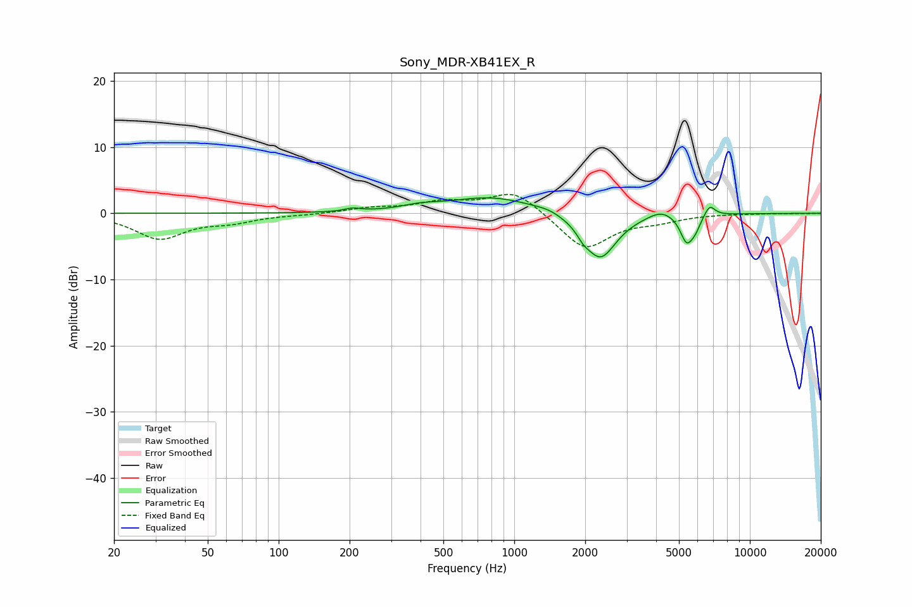

# Sony_MDR-XB41EX_R
See [usage instructions](https://github.com/jaakkopasanen/AutoEq#usage) for more options and info.

### Parametric EQs
Apply preamp of -2.4 dB when using parametric equalizer.

|   # | Type    |   Fc (Hz) |    Q |   Gain (dB) |
|-----|---------|-----------|------|-------------|
|   1 | Peaking |       206 | 4.32 |         0.5 |
|   2 | Peaking |       399 | 1.87 |         0.6 |
|   3 | Peaking |       805 | 0.77 |         2.5 |
|   4 | Peaking |      1402 | 2.65 |         0.4 |
|   5 | Peaking |      1963 | 5.77 |        -0.9 |
|   6 | Peaking |      2317 | 2.03 |        -7   |
|   7 | Peaking |      4205 | 2.56 |         1.2 |
|   8 | Peaking |      5391 | 5.04 |        -4   |
|   9 | Peaking |      5867 | 6    |        -1.5 |
|  10 | Peaking |      6746 | 6    |         1.8 |

### Fixed Band EQs
When using fixed band (also called graphic) equalizer, apply preamp of **-2.9 dB** (if available) and set gains manually with these parameters.

|   # | Type    |   Fc (Hz) |    Q |   Gain (dB) |
|-----|---------|-----------|------|-------------|
|   1 | Peaking |        31 | 1.41 |        -3.7 |
|   2 | Peaking |        62 | 1.41 |        -1.1 |
|   3 | Peaking |       125 | 1.41 |        -0.2 |
|   4 | Peaking |       250 | 1.41 |         0.7 |
|   5 | Peaking |       500 | 1.41 |         1.5 |
|   6 | Peaking |      1000 | 1.41 |         3.5 |
|   7 | Peaking |      2000 | 1.41 |        -5.5 |
|   8 | Peaking |      4000 | 1.41 |        -0.9 |
|   9 | Peaking |      8000 | 1.41 |        -0   |
|  10 | Peaking |     16000 | 1.41 |        -0   |

### Graphs

