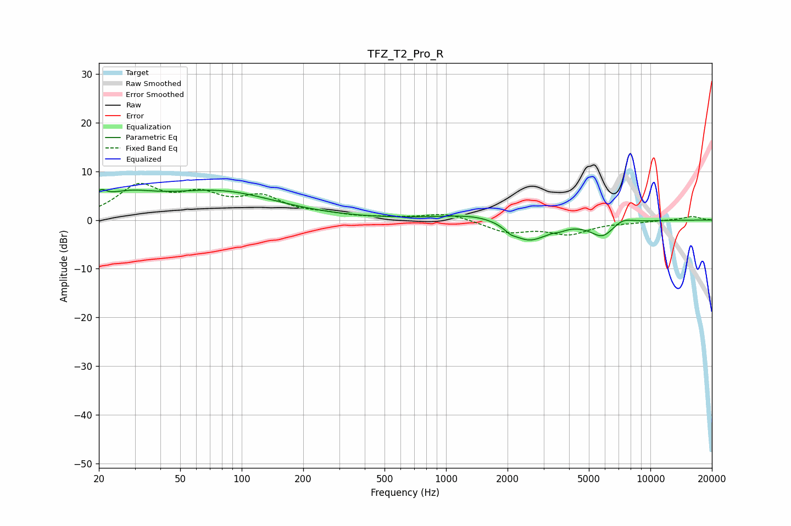

# TFZ_T2_Pro_R
See [usage instructions](https://github.com/jaakkopasanen/AutoEq#usage) for more options and info.

### Parametric EQs
Apply preamp of -6.4 dB when using parametric equalizer.

|   # | Type    |   Fc (Hz) |    Q |   Gain (dB) |
|-----|---------|-----------|------|-------------|
|   1 | Peaking |        20 | 5.86 |         1.7 |
|   2 | Peaking |        24 | 0.8  |         2.5 |
|   3 | Peaking |        28 | 1.2  |         1.4 |
|   4 | Peaking |        78 | 0.49 |         5.5 |
|   5 | Peaking |      1501 | 0.82 |         1.6 |
|   6 | Peaking |      2063 | 5.34 |        -0.7 |
|   7 | Peaking |      2530 | 1.44 |        -4.8 |
|   8 | Peaking |      3637 | 5.73 |        -0.4 |
|   9 | Peaking |      5836 | 2.35 |        -3.2 |
|  10 | Peaking |      7273 | 2.74 |         1.2 |

### Fixed Band EQs
When using fixed band (also called graphic) equalizer, apply preamp of **-7.6 dB** (if available) and set gains manually with these parameters.

|   # | Type    |   Fc (Hz) |    Q |   Gain (dB) |
|-----|---------|-----------|------|-------------|
|   1 | Peaking |        31 | 1.41 |         6.5 |
|   2 | Peaking |        62 | 1.41 |         4.2 |
|   3 | Peaking |       125 | 1.41 |         4.1 |
|   4 | Peaking |       250 | 1.41 |         0.9 |
|   5 | Peaking |       500 | 1.41 |         0.3 |
|   6 | Peaking |      1000 | 1.41 |         1.4 |
|   7 | Peaking |      2000 | 1.41 |        -2.4 |
|   8 | Peaking |      4000 | 1.41 |        -2.7 |
|   9 | Peaking |      8000 | 1.41 |        -0.4 |
|  10 | Peaking |     16000 | 1.41 |         0.8 |

### Graphs

