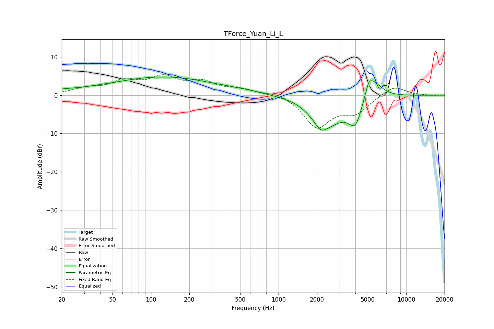

# TForce_Yuan_Li_L
See [usage instructions](https://github.com/jaakkopasanen/AutoEq#usage) for more options and info.

### Parametric EQs
Apply preamp of -4.8 dB when using parametric equalizer.

|   # | Type    |   Fc (Hz) |    Q |   Gain (dB) |
|-----|---------|-----------|------|-------------|
|   1 | Peaking |        20 | 1.24 |         0.7 |
|   2 | Peaking |        37 | 1.4  |         0.2 |
|   3 | Peaking |       124 | 0.35 |         4.7 |
|   4 | Peaking |       564 | 0.89 |         0.5 |
|   5 | Peaking |      1536 | 0.96 |         1.9 |
|   6 | Peaking |      2141 | 3.76 |        -1.6 |
|   7 | Peaking |      2266 | 0.92 |        -8.9 |
|   8 | Peaking |      4009 | 2.62 |        -6.6 |
|   9 | Peaking |      5095 | 5.68 |         2.1 |
|  10 | Peaking |      5413 | 1.9  |         6   |

### Fixed Band EQs
When using fixed band (also called graphic) equalizer, apply preamp of **-5.4 dB** (if available) and set gains manually with these parameters.

|   # | Type    |   Fc (Hz) |    Q |   Gain (dB) |
|-----|---------|-----------|------|-------------|
|   1 | Peaking |        31 | 1.41 |         1.5 |
|   2 | Peaking |        62 | 1.41 |         3.2 |
|   3 | Peaking |       125 | 1.41 |         4.1 |
|   4 | Peaking |       250 | 1.41 |         3   |
|   5 | Peaking |       500 | 1.41 |         1.4 |
|   6 | Peaking |      1000 | 1.41 |         1.1 |
|   7 | Peaking |      2000 | 1.41 |        -8.2 |
|   8 | Peaking |      4000 | 1.41 |        -4.1 |
|   9 | Peaking |      8000 | 1.41 |         2.6 |
|  10 | Peaking |     16000 | 1.41 |        -0.1 |

### Graphs

