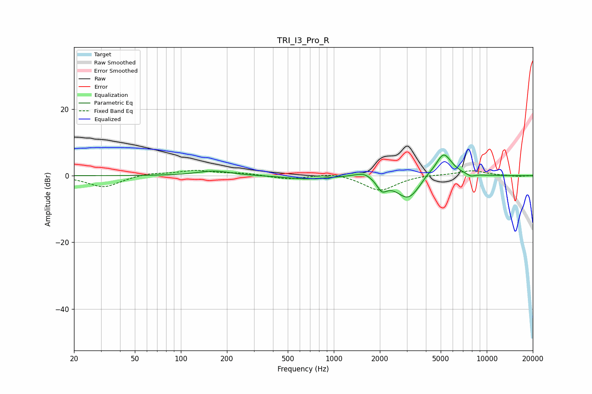

# TRI_I3_Pro_R
See [usage instructions](https://github.com/jaakkopasanen/AutoEq#usage) for more options and info.

### Parametric EQs
Apply preamp of -6.3 dB when using parametric equalizer.

|   # | Type    |   Fc (Hz) |    Q |   Gain (dB) |
|-----|---------|-----------|------|-------------|
|   1 | Peaking |       164 | 1.31 |         1.4 |
|   2 | Peaking |       649 | 1.08 |        -1   |
|   3 | Peaking |      1381 | 1.89 |         0.4 |
|   4 | Peaking |      1593 | 2.83 |         1.4 |
|   5 | Peaking |      2052 | 4.62 |        -2.7 |
|   6 | Peaking |      2153 | 3.94 |        -0.5 |
|   7 | Peaking |      3063 | 1.74 |        -7.2 |
|   8 | Peaking |      4056 | 3.76 |         0.8 |
|   9 | Peaking |      5216 | 2.5  |         7.5 |
|  10 | Peaking |      7860 | 5.01 |        -0.8 |

### Fixed Band EQs
When using fixed band (also called graphic) equalizer, apply preamp of **-1.7 dB** (if available) and set gains manually with these parameters.

|   # | Type    |   Fc (Hz) |    Q |   Gain (dB) |
|-----|---------|-----------|------|-------------|
|   1 | Peaking |        31 | 1.41 |        -3.5 |
|   2 | Peaking |        62 | 1.41 |         0.8 |
|   3 | Peaking |       125 | 1.41 |         1.5 |
|   4 | Peaking |       250 | 1.41 |         0.7 |
|   5 | Peaking |       500 | 1.41 |        -1.1 |
|   6 | Peaking |      1000 | 1.41 |         1   |
|   7 | Peaking |      2000 | 1.41 |        -4.6 |
|   8 | Peaking |      4000 | 1.41 |         0.3 |
|   9 | Peaking |      8000 | 1.41 |         1.5 |
|  10 | Peaking |     16000 | 1.41 |        -0.2 |

### Graphs

