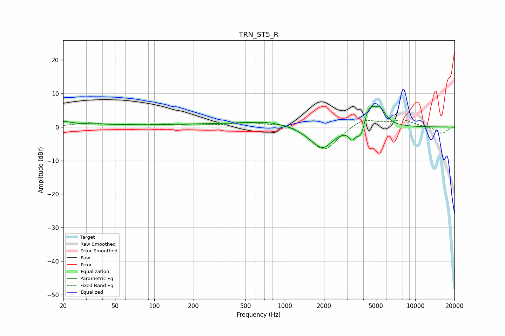

# TRN_ST5_R
See [usage instructions](https://github.com/jaakkopasanen/AutoEq#usage) for more options and info.

### Parametric EQs
Apply preamp of -6.2 dB when using parametric equalizer.

|   # | Type    |   Fc (Hz) |    Q |   Gain (dB) |
|-----|---------|-----------|------|-------------|
|   1 | Peaking |        20 | 2.62 |         1   |
|   2 | Peaking |        30 | 0.5  |         0.8 |
|   3 | Peaking |       337 | 0.34 |         0.9 |
|   4 | Peaking |       748 | 1.04 |         1.1 |
|   5 | Peaking |      1622 | 1.74 |        -0.9 |
|   6 | Peaking |      1961 | 1.73 |        -6   |
|   7 | Peaking |      3273 | 5.87 |        -2.8 |
|   8 | Peaking |      3855 | 4.17 |        -5.4 |
|   9 | Peaking |      4398 | 2.86 |         6.8 |
|  10 | Peaking |      5397 | 3.03 |         4.2 |

### Fixed Band EQs
When using fixed band (also called graphic) equalizer, apply preamp of **-2.2 dB** (if available) and set gains manually with these parameters.

|   # | Type    |   Fc (Hz) |    Q |   Gain (dB) |
|-----|---------|-----------|------|-------------|
|   1 | Peaking |        31 | 1.41 |         1.2 |
|   2 | Peaking |        62 | 1.41 |         0.4 |
|   3 | Peaking |       125 | 1.41 |         0.7 |
|   4 | Peaking |       250 | 1.41 |         0.3 |
|   5 | Peaking |       500 | 1.41 |         1.3 |
|   6 | Peaking |      1000 | 1.41 |         1.5 |
|   7 | Peaking |      2000 | 1.41 |        -7.4 |
|   8 | Peaking |      4000 | 1.41 |         2.8 |
|   9 | Peaking |      8000 | 1.41 |         2   |
|  10 | Peaking |     16000 | 1.41 |        -2   |

### Graphs

