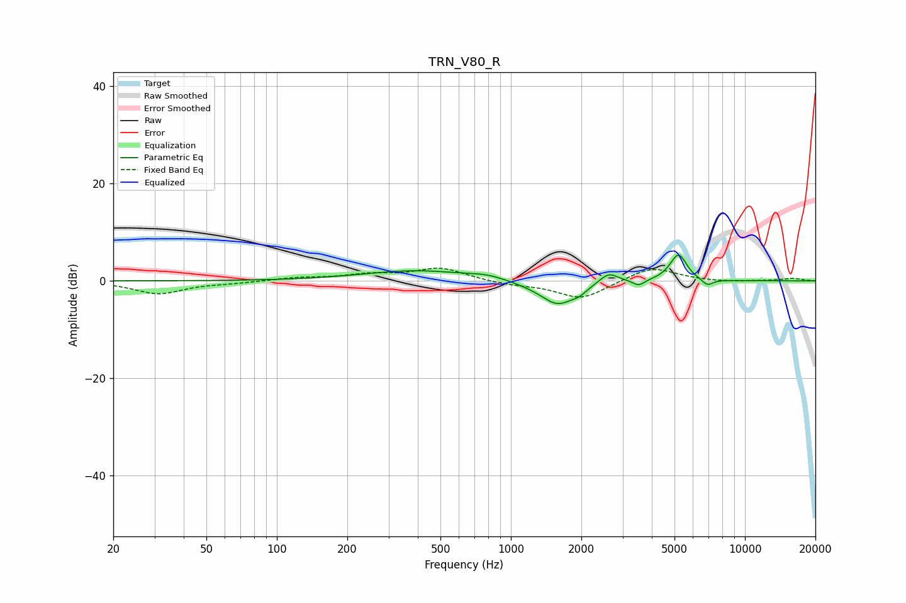

# TRN_V80_R
See [usage instructions](https://github.com/jaakkopasanen/AutoEq#usage) for more options and info.

### Parametric EQs
Apply preamp of -5.4 dB when using parametric equalizer.

|   # | Type    |   Fc (Hz) |    Q |   Gain (dB) |
|-----|---------|-----------|------|-------------|
|   1 | Peaking |       393 | 0.63 |         2.1 |
|   2 | Peaking |       789 | 1.87 |         0.7 |
|   3 | Peaking |      1160 | 2.07 |        -0.2 |
|   4 | Peaking |      1586 | 1.86 |        -4.9 |
|   5 | Peaking |      1963 | 4.63 |        -0.9 |
|   6 | Peaking |      2617 | 3.58 |         2.2 |
|   7 | Peaking |      3517 | 5.75 |        -1.2 |
|   8 | Peaking |      5168 | 3.84 |         5   |
|   9 | Peaking |      5365 | 5.99 |         0.6 |
|  10 | Peaking |      6909 | 5.52 |        -1.4 |

### Fixed Band EQs
When using fixed band (also called graphic) equalizer, apply preamp of **-2.7 dB** (if available) and set gains manually with these parameters.

|   # | Type    |   Fc (Hz) |    Q |   Gain (dB) |
|-----|---------|-----------|------|-------------|
|   1 | Peaking |        31 | 1.41 |        -2.6 |
|   2 | Peaking |        62 | 1.41 |        -0.4 |
|   3 | Peaking |       125 | 1.41 |         0.6 |
|   4 | Peaking |       250 | 1.41 |         1.2 |
|   5 | Peaking |       500 | 1.41 |         2.6 |
|   6 | Peaking |      1000 | 1.41 |        -0.7 |
|   7 | Peaking |      2000 | 1.41 |        -3.8 |
|   8 | Peaking |      4000 | 1.41 |         3   |
|   9 | Peaking |      8000 | 1.41 |        -0.2 |
|  10 | Peaking |     16000 | 1.41 |         0.5 |

### Graphs

