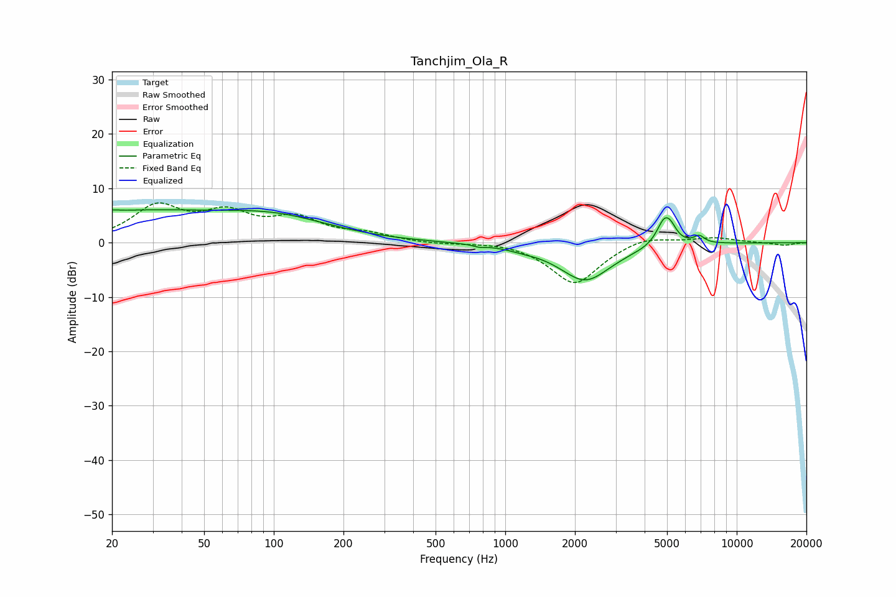

# Tanchjim_Ola_R
See [usage instructions](https://github.com/jaakkopasanen/AutoEq#usage) for more options and info.

### Parametric EQs
Apply preamp of -6.2 dB when using parametric equalizer.

|   # | Type    |   Fc (Hz) |    Q |   Gain (dB) |
|-----|---------|-----------|------|-------------|
|   1 | Peaking |        20 | 5.97 |         0.3 |
|   2 | Peaking |        23 | 0.31 |         5.5 |
|   3 | Peaking |       105 | 0.6  |         3.5 |
|   4 | Peaking |       744 | 5.94 |         0.2 |
|   5 | Peaking |       765 | 5.38 |        -0.5 |
|   6 | Peaking |      1191 | 2.25 |        -0.4 |
|   7 | Peaking |      2215 | 1.26 |        -6.9 |
|   8 | Peaking |      4864 | 4.15 |         4.6 |
|   9 | Peaking |      5207 | 5.39 |         1.6 |
|  10 | Peaking |      6884 | 5.96 |         1.3 |

### Fixed Band EQs
When using fixed band (also called graphic) equalizer, apply preamp of **-7.4 dB** (if available) and set gains manually with these parameters.

|   # | Type    |   Fc (Hz) |    Q |   Gain (dB) |
|-----|---------|-----------|------|-------------|
|   1 | Peaking |        31 | 1.41 |         6.3 |
|   2 | Peaking |        62 | 1.41 |         4.6 |
|   3 | Peaking |       125 | 1.41 |         3.9 |
|   4 | Peaking |       250 | 1.41 |         1.4 |
|   5 | Peaking |       500 | 1.41 |        -0.3 |
|   6 | Peaking |      1000 | 1.41 |         0.4 |
|   7 | Peaking |      2000 | 1.41 |        -7.7 |
|   8 | Peaking |      4000 | 1.41 |         1.5 |
|   9 | Peaking |      8000 | 1.41 |         0.9 |
|  10 | Peaking |     16000 | 1.41 |        -0.5 |

### Graphs

