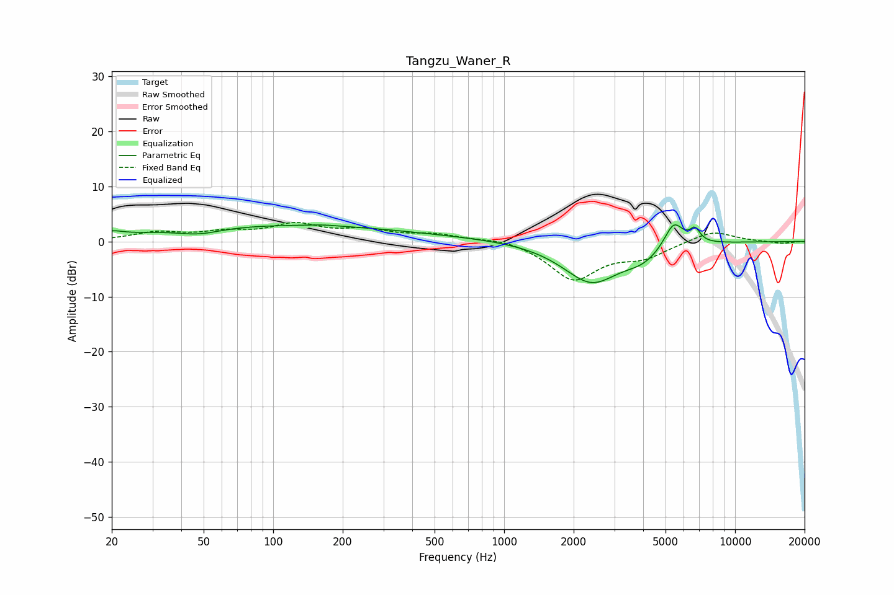

# Tangzu_Waner_R
See [usage instructions](https://github.com/jaakkopasanen/AutoEq#usage) for more options and info.

### Parametric EQs
Apply preamp of -3.1 dB when using parametric equalizer.

|   # | Type    |   Fc (Hz) |    Q |   Gain (dB) |
|-----|---------|-----------|------|-------------|
|   1 | Peaking |        20 | 3.22 |         0.8 |
|   2 | Peaking |        48 | 1.49 |        -1.2 |
|   3 | Peaking |        48 | 1.49 |         0   |
|   4 | Peaking |        93 | 0.25 |         2.9 |
|   5 | Peaking |       164 | 2.24 |         0.2 |
|   6 | Peaking |       935 | 0.22 |         0.6 |
|   7 | Peaking |      2387 | 1.1  |        -7.7 |
|   8 | Peaking |      3988 | 1.8  |        -2   |
|   9 | Peaking |      5426 | 3.35 |         4.8 |
|  10 | Peaking |      6707 | 6    |         2.3 |

### Fixed Band EQs
When using fixed band (also called graphic) equalizer, apply preamp of **-3.6 dB** (if available) and set gains manually with these parameters.

|   # | Type    |   Fc (Hz) |    Q |   Gain (dB) |
|-----|---------|-----------|------|-------------|
|   1 | Peaking |        31 | 1.41 |         1.5 |
|   2 | Peaking |        62 | 1.41 |         1.4 |
|   3 | Peaking |       125 | 1.41 |         2.8 |
|   4 | Peaking |       250 | 1.41 |         1.8 |
|   5 | Peaking |       500 | 1.41 |         1.2 |
|   6 | Peaking |      1000 | 1.41 |         0.8 |
|   7 | Peaking |      2000 | 1.41 |        -6.8 |
|   8 | Peaking |      4000 | 1.41 |        -2.5 |
|   9 | Peaking |      8000 | 1.41 |         2.1 |
|  10 | Peaking |     16000 | 1.41 |        -0.4 |

### Graphs

