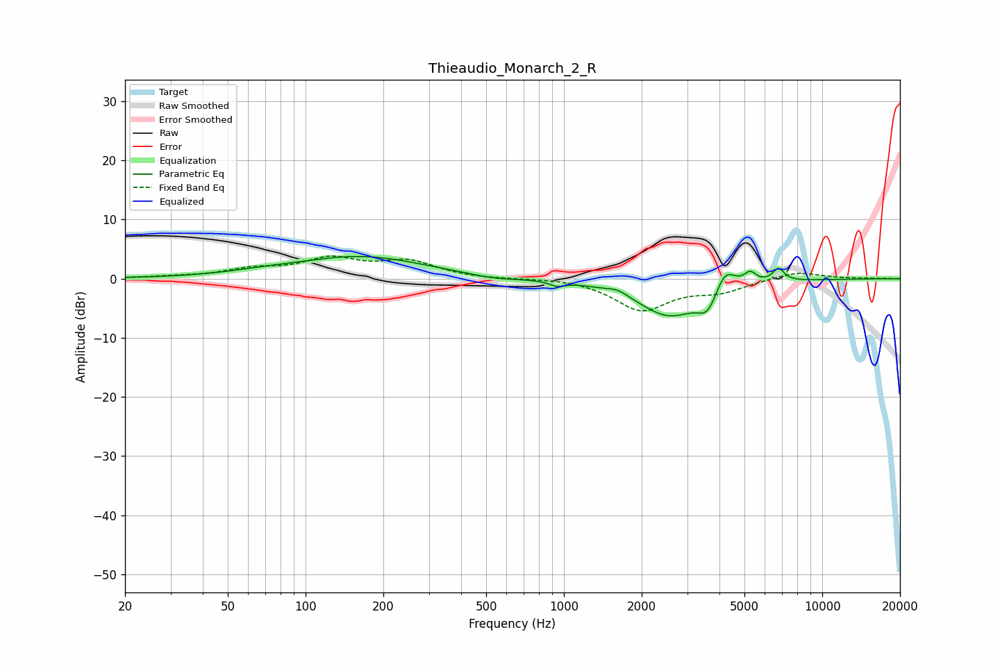

# Thieaudio_Monarch_2_R
See [usage instructions](https://github.com/jaakkopasanen/AutoEq#usage) for more options and info.

### Parametric EQs
Apply preamp of -3.9 dB when using parametric equalizer.

|   # | Type    |   Fc (Hz) |    Q |   Gain (dB) |
|-----|---------|-----------|------|-------------|
|   1 | Peaking |        67 | 1.08 |         0.4 |
|   2 | Peaking |       163 | 0.57 |         3.7 |
|   3 | Peaking |       533 | 1.49 |        -0.6 |
|   4 | Peaking |       942 | 5.05 |        -0.8 |
|   5 | Peaking |      1617 | 3.63 |         0.8 |
|   6 | Peaking |      2556 | 1.13 |        -6.2 |
|   7 | Peaking |      3605 | 3.72 |        -3.5 |
|   8 | Peaking |      4204 | 3.57 |         4   |
|   9 | Peaking |      5264 | 6    |         1.8 |
|  10 | Peaking |      6770 | 5.99 |         2.2 |

### Fixed Band EQs
When using fixed band (also called graphic) equalizer, apply preamp of **-3.9 dB** (if available) and set gains manually with these parameters.

|   # | Type    |   Fc (Hz) |    Q |   Gain (dB) |
|-----|---------|-----------|------|-------------|
|   1 | Peaking |        31 | 1.41 |         0.2 |
|   2 | Peaking |        62 | 1.41 |         1.4 |
|   3 | Peaking |       125 | 1.41 |         3.1 |
|   4 | Peaking |       250 | 1.41 |         2.7 |
|   5 | Peaking |       500 | 1.41 |        -0.1 |
|   6 | Peaking |      1000 | 1.41 |         0.2 |
|   7 | Peaking |      2000 | 1.41 |        -5.2 |
|   8 | Peaking |      4000 | 1.41 |        -1.9 |
|   9 | Peaking |      8000 | 1.41 |         1.3 |
|  10 | Peaking |     16000 | 1.41 |         0.1 |

### Graphs

