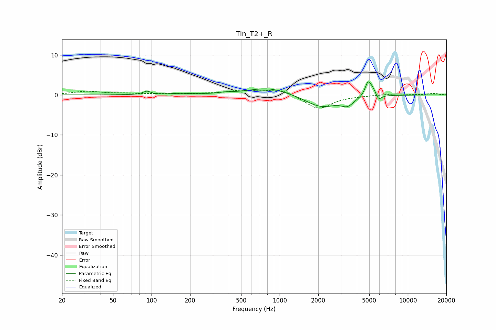

# Tin_T2+_R
See [usage instructions](https://github.com/jaakkopasanen/AutoEq#usage) for more options and info.

### Parametric EQs
Apply preamp of -3.4 dB when using parametric equalizer.

|   # | Type    |   Fc (Hz) |    Q |   Gain (dB) |
|-----|---------|-----------|------|-------------|
|   1 | Peaking |        92 | 4.98 |         0.9 |
|   2 | Peaking |       167 | 2.27 |         0.3 |
|   3 | Peaking |       374 | 2.58 |         0.3 |
|   4 | Peaking |       822 | 0.89 |         1.9 |
|   5 | Peaking |      2108 | 1.14 |        -3.1 |
|   6 | Peaking |      3388 | 2.89 |        -1.9 |
|   7 | Peaking |      4879 | 5.98 |         3.2 |
|   8 | Peaking |      5135 | 6    |         0.9 |
|   9 | Peaking |      5440 | 6    |         1   |
|  10 | Peaking |      5902 | 6    |        -1.5 |

### Fixed Band EQs
When using fixed band (also called graphic) equalizer, apply preamp of **-1.3 dB** (if available) and set gains manually with these parameters.

|   # | Type    |   Fc (Hz) |    Q |   Gain (dB) |
|-----|---------|-----------|------|-------------|
|   1 | Peaking |        31 | 1.41 |         0.8 |
|   2 | Peaking |        62 | 1.41 |         0.3 |
|   3 | Peaking |       125 | 1.41 |         0.2 |
|   4 | Peaking |       250 | 1.41 |         0.2 |
|   5 | Peaking |       500 | 1.41 |         1   |
|   6 | Peaking |      1000 | 1.41 |         1.5 |
|   7 | Peaking |      2000 | 1.41 |        -3.6 |
|   8 | Peaking |      4000 | 1.41 |        -0.1 |
|   9 | Peaking |      8000 | 1.41 |         0.3 |
|  10 | Peaking |     16000 | 1.41 |         0.4 |

### Graphs

