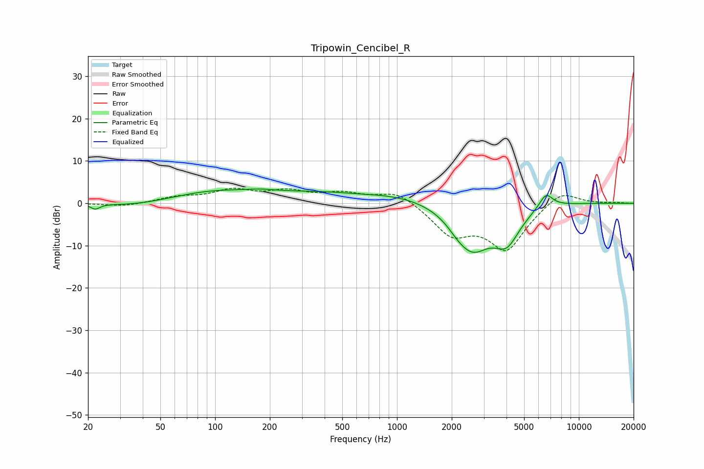

# Tripowin_Cencibel_R
See [usage instructions](https://github.com/jaakkopasanen/AutoEq#usage) for more options and info.

### Parametric EQs
Apply preamp of -3.5 dB when using parametric equalizer.

|   # | Type    |   Fc (Hz) |    Q |   Gain (dB) |
|-----|---------|-----------|------|-------------|
|   1 | Peaking |        22 | 5.77 |        -1.2 |
|   2 | Peaking |        36 | 0.87 |        -0.8 |
|   3 | Peaking |        95 | 0.65 |         2.3 |
|   4 | Peaking |       178 | 1.8  |         0.5 |
|   5 | Peaking |       619 | 1.02 |        -0.5 |
|   6 | Peaking |      1016 | 0.18 |         3.4 |
|   7 | Peaking |      2171 | 2.58 |        -1.4 |
|   8 | Peaking |      2606 | 1.2  |       -11.9 |
|   9 | Peaking |      4020 | 1.91 |        -7.5 |
|  10 | Peaking |      6594 | 3.59 |         3.5 |

### Fixed Band EQs
When using fixed band (also called graphic) equalizer, apply preamp of **-3.7 dB** (if available) and set gains manually with these parameters.

|   # | Type    |   Fc (Hz) |    Q |   Gain (dB) |
|-----|---------|-----------|------|-------------|
|   1 | Peaking |        31 | 1.41 |        -0.8 |
|   2 | Peaking |        62 | 1.41 |         1.3 |
|   3 | Peaking |       125 | 1.41 |         2.8 |
|   4 | Peaking |       250 | 1.41 |         2.5 |
|   5 | Peaking |       500 | 1.41 |         2.1 |
|   6 | Peaking |      1000 | 1.41 |         3.1 |
|   7 | Peaking |      2000 | 1.41 |        -6.8 |
|   8 | Peaking |      4000 | 1.41 |       -10.5 |
|   9 | Peaking |      8000 | 1.41 |         3.6 |
|  10 | Peaking |     16000 | 1.41 |         0.2 |

### Graphs

