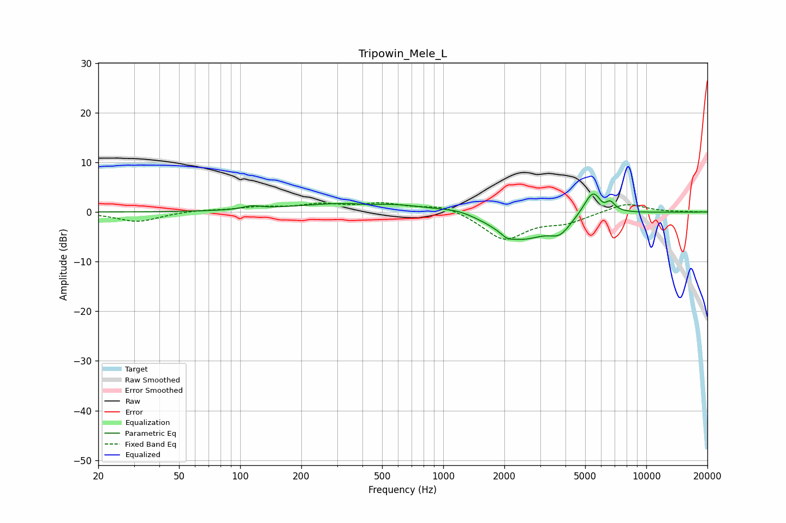

# Tripowin_Mele_L
See [usage instructions](https://github.com/jaakkopasanen/AutoEq#usage) for more options and info.

### Parametric EQs
Apply preamp of -3.7 dB when using parametric equalizer.

|   # | Type    |   Fc (Hz) |    Q |   Gain (dB) |
|-----|---------|-----------|------|-------------|
|   1 | Peaking |       114 | 3.3  |         0.7 |
|   2 | Peaking |       418 | 0.45 |         2   |
|   3 | Peaking |       429 | 2.35 |        -0.4 |
|   4 | Peaking |      1204 | 1.93 |         0.7 |
|   5 | Peaking |      2062 | 5.16 |        -0.8 |
|   6 | Peaking |      2410 | 1.09 |        -5.4 |
|   7 | Peaking |      3757 | 2.64 |        -2.8 |
|   8 | Peaking |      5473 | 3.02 |         5.2 |
|   9 | Peaking |      6113 | 6    |        -0.9 |
|  10 | Peaking |      6648 | 6    |         1.6 |

### Fixed Band EQs
When using fixed band (also called graphic) equalizer, apply preamp of **-2.0 dB** (if available) and set gains manually with these parameters.

|   # | Type    |   Fc (Hz) |    Q |   Gain (dB) |
|-----|---------|-----------|------|-------------|
|   1 | Peaking |        31 | 1.41 |        -2   |
|   2 | Peaking |        62 | 1.41 |         0.4 |
|   3 | Peaking |       125 | 1.41 |         0.9 |
|   4 | Peaking |       250 | 1.41 |         1.4 |
|   5 | Peaking |       500 | 1.41 |         1.5 |
|   6 | Peaking |      1000 | 1.41 |         1.5 |
|   7 | Peaking |      2000 | 1.41 |        -5.5 |
|   8 | Peaking |      4000 | 1.41 |        -1.8 |
|   9 | Peaking |      8000 | 1.41 |         1.9 |
|  10 | Peaking |     16000 | 1.41 |         0.1 |

### Graphs

