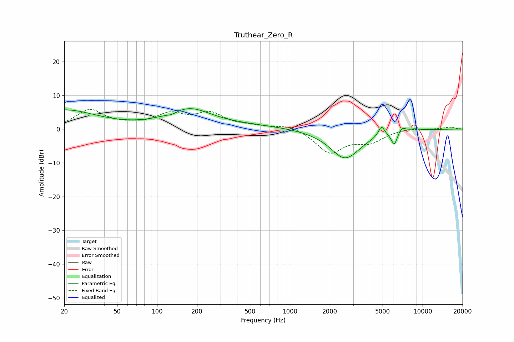

# Truthear_Zero_R
See [usage instructions](https://github.com/jaakkopasanen/AutoEq#usage) for more options and info.

### Parametric EQs
Apply preamp of -6.1 dB when using parametric equalizer.

|   # | Type    |   Fc (Hz) |    Q |   Gain (dB) |
|-----|---------|-----------|------|-------------|
|   1 | Peaking |        20 | 0.58 |         5.6 |
|   2 | Peaking |       130 | 3.68 |        -0.7 |
|   3 | Peaking |       174 | 0.84 |         5.6 |
|   4 | Peaking |       510 | 0.48 |         0.9 |
|   5 | Peaking |      2627 | 1.27 |        -9.2 |
|   6 | Peaking |      2708 | 2.78 |         0.5 |
|   7 | Peaking |      4902 | 5.91 |         3.1 |
|   8 | Peaking |      6122 | 5.83 |        -4   |
|   9 | Peaking |      6976 | 4.73 |         1.6 |
|  10 | Peaking |      8698 | 3.42 |         0.5 |

### Fixed Band EQs
When using fixed band (also called graphic) equalizer, apply preamp of **-5.9 dB** (if available) and set gains manually with these parameters.

|   # | Type    |   Fc (Hz) |    Q |   Gain (dB) |
|-----|---------|-----------|------|-------------|
|   1 | Peaking |        31 | 1.41 |         5.5 |
|   2 | Peaking |        62 | 1.41 |         0.7 |
|   3 | Peaking |       125 | 1.41 |         3.9 |
|   4 | Peaking |       250 | 1.41 |         4.3 |
|   5 | Peaking |       500 | 1.41 |         0.7 |
|   6 | Peaking |      1000 | 1.41 |         1.5 |
|   7 | Peaking |      2000 | 1.41 |        -6.9 |
|   8 | Peaking |      4000 | 1.41 |        -3.4 |
|   9 | Peaking |      8000 | 1.41 |         0.4 |
|  10 | Peaking |     16000 | 1.41 |         0.6 |

### Graphs

