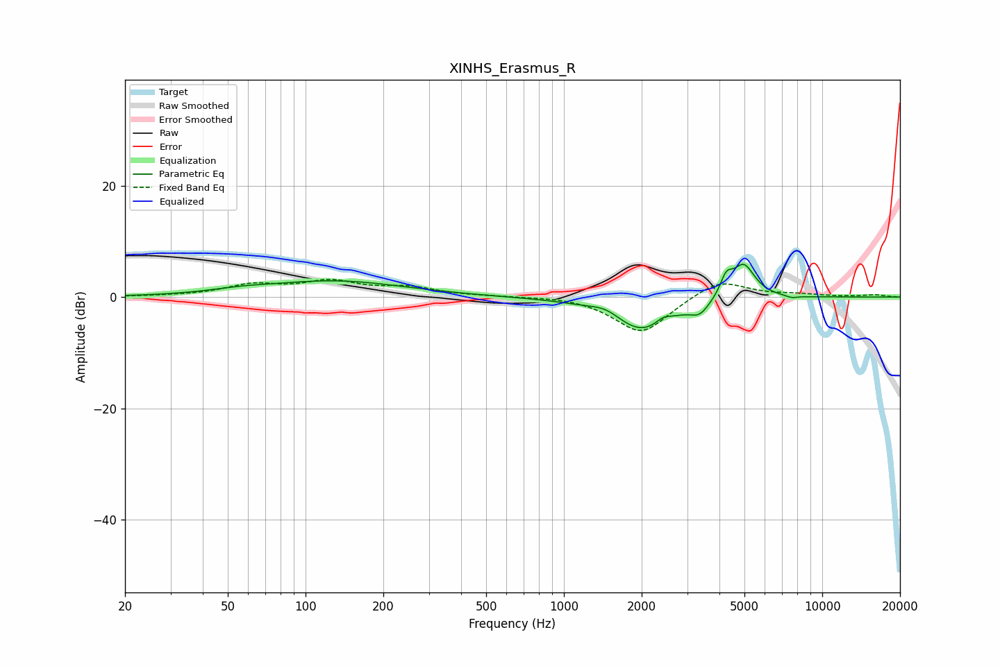

# XINHS_Erasmus_R
See [usage instructions](https://github.com/jaakkopasanen/AutoEq#usage) for more options and info.

### Parametric EQs
Apply preamp of -6.0 dB when using parametric equalizer.

|   # | Type    |   Fc (Hz) |    Q |   Gain (dB) |
|-----|---------|-----------|------|-------------|
|   1 | Peaking |        57 | 1.2  |         0.6 |
|   2 | Peaking |       130 | 0.53 |         2.8 |
|   3 | Peaking |      1459 | 2.37 |         1.4 |
|   4 | Peaking |      1994 | 1.19 |        -6.3 |
|   5 | Peaking |      2426 | 4.76 |         1.1 |
|   6 | Peaking |      3338 | 4.02 |        -1.7 |
|   7 | Peaking |      3493 | 3.48 |        -0.4 |
|   8 | Peaking |      4253 | 5.92 |         3.2 |
|   9 | Peaking |      4964 | 3.09 |         6.2 |
|  10 | Peaking |      7621 | 5.67 |        -0.4 |

### Fixed Band EQs
When using fixed band (also called graphic) equalizer, apply preamp of **-3.3 dB** (if available) and set gains manually with these parameters.

|   # | Type    |   Fc (Hz) |    Q |   Gain (dB) |
|-----|---------|-----------|------|-------------|
|   1 | Peaking |        31 | 1.41 |         0.1 |
|   2 | Peaking |        62 | 1.41 |         2   |
|   3 | Peaking |       125 | 1.41 |         2.5 |
|   4 | Peaking |       250 | 1.41 |         1.5 |
|   5 | Peaking |       500 | 1.41 |         0.1 |
|   6 | Peaking |      1000 | 1.41 |         0.3 |
|   7 | Peaking |      2000 | 1.41 |        -6.7 |
|   8 | Peaking |      4000 | 1.41 |         3.4 |
|   9 | Peaking |      8000 | 1.41 |         0.4 |
|  10 | Peaking |     16000 | 1.41 |         0.4 |

### Graphs

