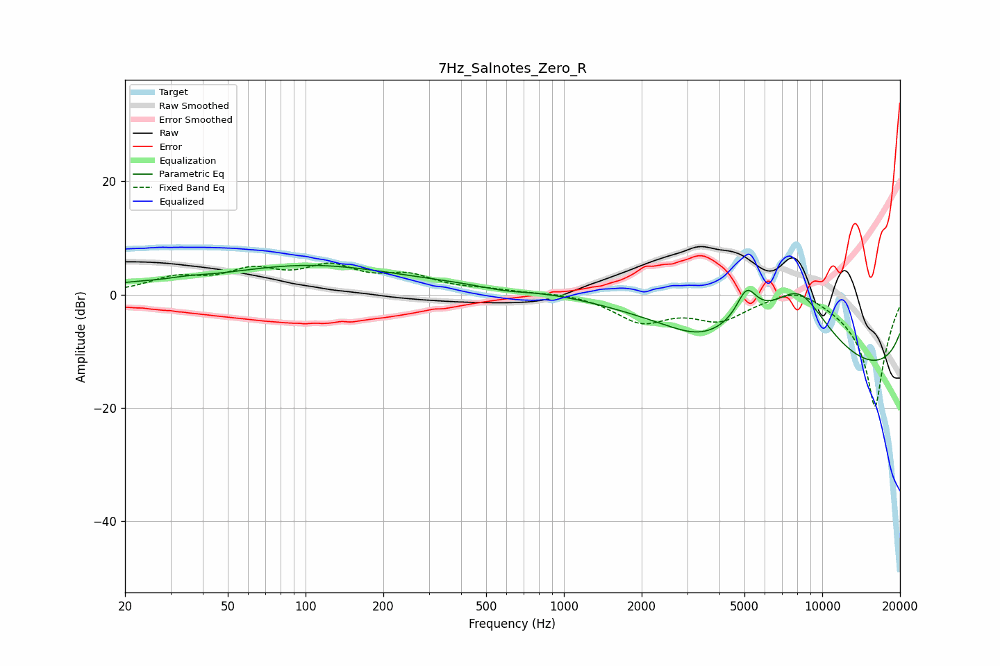

# 7Hz_Salnotes_Zero_R
See [usage instructions](https://github.com/jaakkopasanen/AutoEq#usage) for more options and info.

### Parametric EQs
Apply preamp of -5.2 dB when using parametric equalizer.

|   # | Type    |   Fc (Hz) |    Q |   Gain (dB) |
|-----|---------|-----------|------|-------------|
|   1 | Peaking |        20 | 1.14 |         1   |
|   2 | Peaking |        34 | 1.69 |         0.5 |
|   3 | Peaking |        42 | 5.98 |        -0   |
|   4 | Peaking |       102 | 0.4  |         5   |
|   5 | Peaking |       591 | 1.41 |        -0.8 |
|   6 | Peaking |      2430 | 0.19 |         4.2 |
|   7 | Peaking |      3366 | 1.11 |        -2.7 |
|   8 | Peaking |      5097 | 3.45 |         5.6 |
|   9 | Peaking |      8139 | 0.76 |        15.9 |
|  10 | Peaking |     10000 | 0.18 |       -19.1 |

### Fixed Band EQs
When using fixed band (also called graphic) equalizer, apply preamp of **-5.6 dB** (if available) and set gains manually with these parameters.

|   # | Type    |   Fc (Hz) |    Q |   Gain (dB) |
|-----|---------|-----------|------|-------------|
|   1 | Peaking |        31 | 1.41 |         2.6 |
|   2 | Peaking |        62 | 1.41 |         3.6 |
|   3 | Peaking |       125 | 1.41 |         4.2 |
|   4 | Peaking |       250 | 1.41 |         2.8 |
|   5 | Peaking |       500 | 1.41 |         0.6 |
|   6 | Peaking |      1000 | 1.41 |         0.4 |
|   7 | Peaking |      2000 | 1.41 |        -4.5 |
|   8 | Peaking |      4000 | 1.41 |        -4   |
|   9 | Peaking |      8000 | 1.41 |         2.4 |
|  10 | Peaking |     16000 | 1.41 |       -20   |

### Graphs

