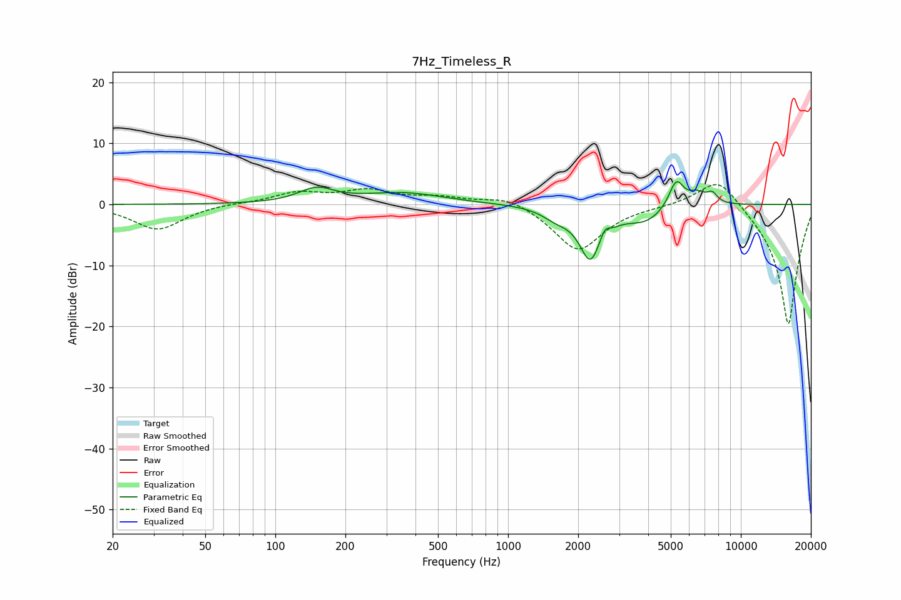

# 7Hz_Timeless_R
See [usage instructions](https://github.com/jaakkopasanen/AutoEq#usage) for more options and info.

### Parametric EQs
Apply preamp of -3.8 dB when using parametric equalizer.

|   # | Type    |   Fc (Hz) |    Q |   Gain (dB) |
|-----|---------|-----------|------|-------------|
|   1 | Peaking |       150 | 1.85 |         2.3 |
|   2 | Peaking |       354 | 0.81 |         1.8 |
|   3 | Peaking |      1611 | 2.38 |        -1.5 |
|   4 | Peaking |      2256 | 2.96 |        -8.4 |
|   5 | Peaking |      2607 | 5.97 |         2.3 |
|   6 | Peaking |      2685 | 3.81 |        -0.9 |
|   7 | Peaking |      3889 | 1.58 |        -2.6 |
|   8 | Peaking |      5279 | 4.25 |         4.6 |
|   9 | Peaking |      6501 | 3.5  |         1.8 |
|  10 | Peaking |      7540 | 5.98 |         1.5 |

### Fixed Band EQs
When using fixed band (also called graphic) equalizer, apply preamp of **-3.3 dB** (if available) and set gains manually with these parameters.

|   # | Type    |   Fc (Hz) |    Q |   Gain (dB) |
|-----|---------|-----------|------|-------------|
|   1 | Peaking |        31 | 1.41 |        -4.1 |
|   2 | Peaking |        62 | 1.41 |         0.2 |
|   3 | Peaking |       125 | 1.41 |         1.8 |
|   4 | Peaking |       250 | 1.41 |         2.1 |
|   5 | Peaking |       500 | 1.41 |         1   |
|   6 | Peaking |      1000 | 1.41 |         1.6 |
|   7 | Peaking |      2000 | 1.41 |        -7.7 |
|   8 | Peaking |      4000 | 1.41 |        -0.1 |
|   9 | Peaking |      8000 | 1.41 |         5.2 |
|  10 | Peaking |     16000 | 1.41 |       -20   |

### Graphs

