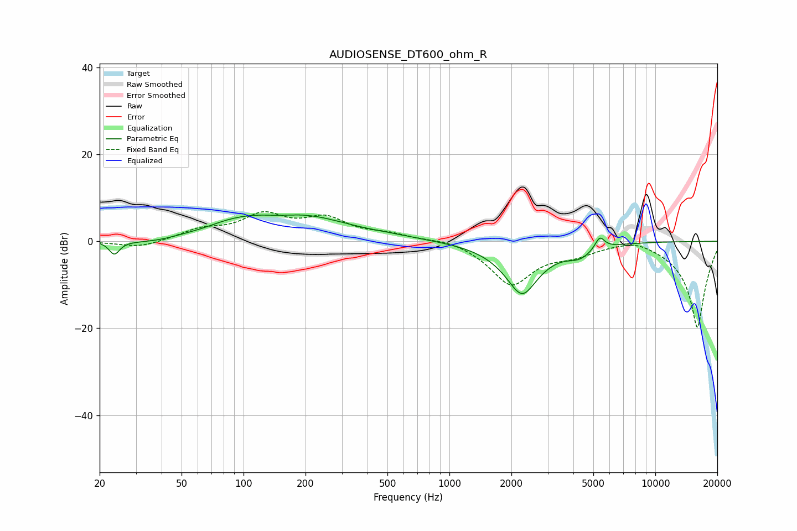

# AUDIOSENSE_DT600_ohm_R
See [usage instructions](https://github.com/jaakkopasanen/AutoEq#usage) for more options and info.

### Parametric EQs
Apply preamp of -6.2 dB when using parametric equalizer.

|   # | Type    |   Fc (Hz) |    Q |   Gain (dB) |
|-----|---------|-----------|------|-------------|
|   1 | Peaking |        24 | 5.65 |        -3.1 |
|   2 | Peaking |        39 | 0.83 |        -2.6 |
|   3 | Peaking |        64 | 1.46 |        -0.9 |
|   4 | Peaking |        99 | 0.43 |         6   |
|   5 | Peaking |       148 | 1.77 |        -0.6 |
|   6 | Peaking |       219 | 0.78 |         2.3 |
|   7 | Peaking |       514 | 1    |         0.6 |
|   8 | Peaking |      2253 | 1.65 |       -12   |
|   9 | Peaking |      4295 | 2.29 |        -2.3 |
|  10 | Peaking |      5373 | 6    |         2.9 |

### Fixed Band EQs
When using fixed band (also called graphic) equalizer, apply preamp of **-6.9 dB** (if available) and set gains manually with these parameters.

|   # | Type    |   Fc (Hz) |    Q |   Gain (dB) |
|-----|---------|-----------|------|-------------|
|   1 | Peaking |        31 | 1.41 |        -1.6 |
|   2 | Peaking |        62 | 1.41 |         2.3 |
|   3 | Peaking |       125 | 1.41 |         5.5 |
|   4 | Peaking |       250 | 1.41 |         4.7 |
|   5 | Peaking |       500 | 1.41 |         1.4 |
|   6 | Peaking |      1000 | 1.41 |         0.9 |
|   7 | Peaking |      2000 | 1.41 |        -9.9 |
|   8 | Peaking |      4000 | 1.41 |        -2.2 |
|   9 | Peaking |      8000 | 1.41 |         1.5 |
|  10 | Peaking |     16000 | 1.41 |       -20   |

### Graphs

