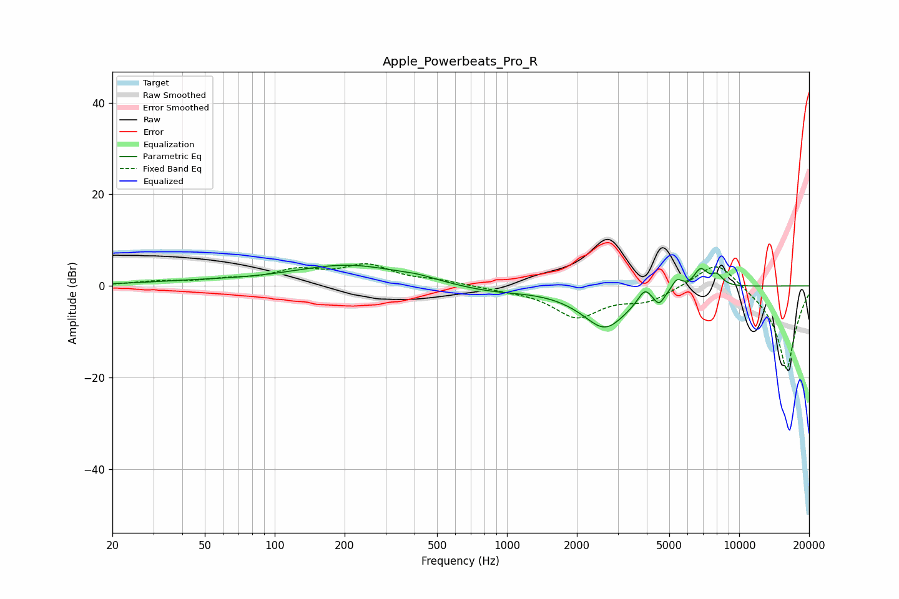

# Apple_Powerbeats_Pro_R
See [usage instructions](https://github.com/jaakkopasanen/AutoEq#usage) for more options and info.

### Parametric EQs
Apply preamp of -4.6 dB when using parametric equalizer.

|   # | Type    |   Fc (Hz) |    Q |   Gain (dB) |
|-----|---------|-----------|------|-------------|
|   1 | Peaking |        45 | 0.57 |         0.8 |
|   2 | Peaking |       208 | 0.58 |         4.5 |
|   3 | Peaking |       414 | 2.05 |         0.6 |
|   4 | Peaking |       840 | 0.91 |        -1.3 |
|   5 | Peaking |      2645 | 1.37 |        -9.1 |
|   6 | Peaking |      3920 | 4.84 |         3   |
|   7 | Peaking |      4517 | 6    |        -2.6 |
|   8 | Peaking |      5395 | 5.98 |         2.5 |
|   9 | Peaking |      6821 | 4.58 |         4   |
|  10 | Peaking |      8017 | 5.16 |         2.3 |

### Fixed Band EQs
When using fixed band (also called graphic) equalizer, apply preamp of **-4.9 dB** (if available) and set gains manually with these parameters.

|   # | Type    |   Fc (Hz) |    Q |   Gain (dB) |
|-----|---------|-----------|------|-------------|
|   1 | Peaking |        31 | 1.41 |         0.8 |
|   2 | Peaking |        62 | 1.41 |         1.1 |
|   3 | Peaking |       125 | 1.41 |         3   |
|   4 | Peaking |       250 | 1.41 |         4.1 |
|   5 | Peaking |       500 | 1.41 |         0.9 |
|   6 | Peaking |      1000 | 1.41 |        -0.5 |
|   7 | Peaking |      2000 | 1.41 |        -6.6 |
|   8 | Peaking |      4000 | 1.41 |        -3   |
|   9 | Peaking |      8000 | 1.41 |         6.3 |
|  10 | Peaking |     16000 | 1.41 |       -18.5 |

### Graphs

