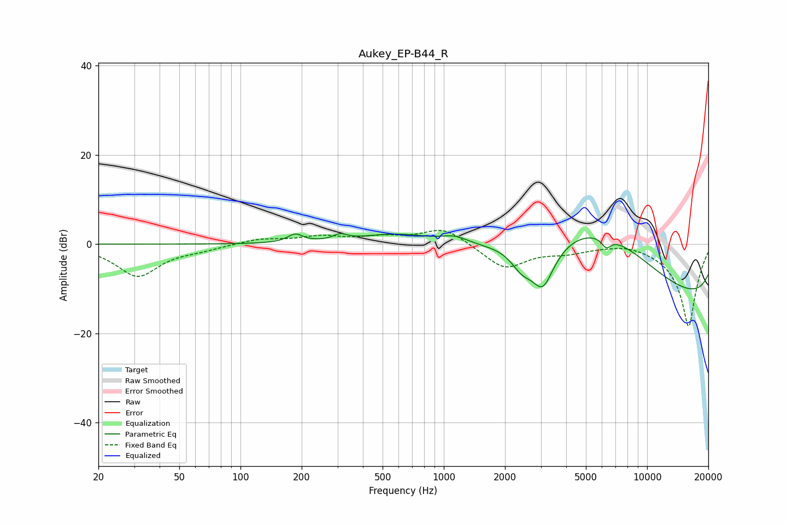

# Aukey_EP-B44_R
See [usage instructions](https://github.com/jaakkopasanen/AutoEq#usage) for more options and info.

### Parametric EQs
Apply preamp of -2.5 dB when using parametric equalizer.

|   # | Type    |   Fc (Hz) |    Q |   Gain (dB) |
|-----|---------|-----------|------|-------------|
|   1 | Peaking |       186 | 3.83 |         1.8 |
|   2 | Peaking |       309 | 4.28 |         1.2 |
|   3 | Peaking |       605 | 0.75 |         2.8 |
|   4 | Peaking |      1134 | 2.07 |         1.7 |
|   5 | Peaking |      2419 | 2.64 |        -3.9 |
|   6 | Peaking |      3069 | 2.22 |       -10.9 |
|   7 | Peaking |      5211 | 0.39 |         8.3 |
|   8 | Peaking |      6294 | 5.93 |        -2.2 |
|   9 | Peaking |      6500 | 0.33 |        12.5 |
|  10 | Peaking |     10000 | 0.18 |       -20   |

### Fixed Band EQs
When using fixed band (also called graphic) equalizer, apply preamp of **-3.2 dB** (if available) and set gains manually with these parameters.

|   # | Type    |   Fc (Hz) |    Q |   Gain (dB) |
|-----|---------|-----------|------|-------------|
|   1 | Peaking |        31 | 1.41 |        -7.1 |
|   2 | Peaking |        62 | 1.41 |        -0.9 |
|   3 | Peaking |       125 | 1.41 |         1.2 |
|   4 | Peaking |       250 | 1.41 |         1.6 |
|   5 | Peaking |       500 | 1.41 |         1.3 |
|   6 | Peaking |      1000 | 1.41 |         3.8 |
|   7 | Peaking |      2000 | 1.41 |        -5.5 |
|   8 | Peaking |      4000 | 1.41 |        -1.4 |
|   9 | Peaking |      8000 | 1.41 |         0.8 |
|  10 | Peaking |     16000 | 1.41 |       -18.5 |

### Graphs

