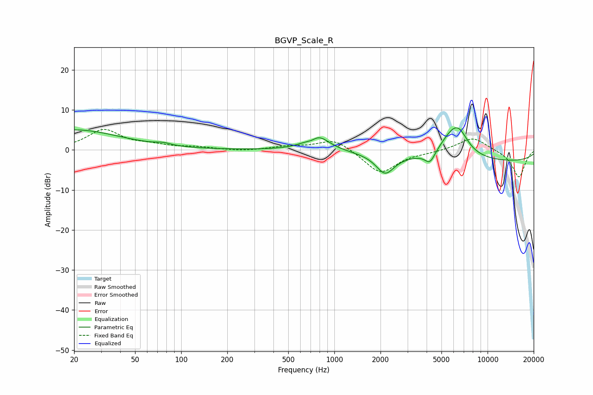

# BGVP_Scale_R
See [usage instructions](https://github.com/jaakkopasanen/AutoEq#usage) for more options and info.

### Parametric EQs
Apply preamp of -5.6 dB when using parametric equalizer.

|   # | Type    |   Fc (Hz) |    Q |   Gain (dB) |
|-----|---------|-----------|------|-------------|
|   1 | Peaking |        20 | 0.47 |         5   |
|   2 | Peaking |        76 | 3.14 |         0.6 |
|   3 | Peaking |       712 | 3.51 |        -1.1 |
|   4 | Peaking |       727 | 3.94 |        -0.3 |
|   5 | Peaking |       762 | 1.94 |         4.5 |
|   6 | Peaking |      2145 | 2.42 |        -4.8 |
|   7 | Peaking |      4206 | 4.22 |        -2.9 |
|   8 | Peaking |      5888 | 1.6  |         5.8 |
|   9 | Peaking |      6535 | 2.45 |         3.3 |
|  10 | Peaking |     10000 | 0.18 |        -3   |

### Fixed Band EQs
When using fixed band (also called graphic) equalizer, apply preamp of **-5.2 dB** (if available) and set gains manually with these parameters.

|   # | Type    |   Fc (Hz) |    Q |   Gain (dB) |
|-----|---------|-----------|------|-------------|
|   1 | Peaking |        31 | 1.41 |         4.9 |
|   2 | Peaking |        62 | 1.41 |         1   |
|   3 | Peaking |       125 | 1.41 |         0.6 |
|   4 | Peaking |       250 | 1.41 |        -0.3 |
|   5 | Peaking |       500 | 1.41 |         0.8 |
|   6 | Peaking |      1000 | 1.41 |         2.9 |
|   7 | Peaking |      2000 | 1.41 |        -5.9 |
|   8 | Peaking |      4000 | 1.41 |        -0.4 |
|   9 | Peaking |      8000 | 1.41 |         3.3 |
|  10 | Peaking |     16000 | 1.41 |        -6.9 |

### Graphs

