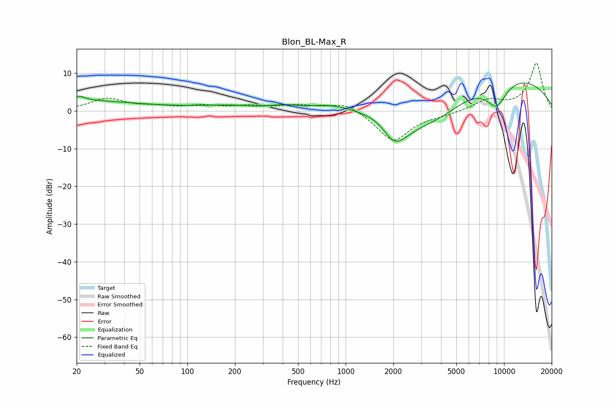

# Blon_BL-Max_R
See [usage instructions](https://github.com/jaakkopasanen/AutoEq#usage) for more options and info.

### Parametric EQs
Apply preamp of -7.5 dB when using parametric equalizer.

|   # | Type    |   Fc (Hz) |    Q |   Gain (dB) |
|-----|---------|-----------|------|-------------|
|   1 | Peaking |        20 | 0.36 |         2.7 |
|   2 | Peaking |        21 | 4.01 |         1.1 |
|   3 | Peaking |       291 | 1.36 |        -1.1 |
|   4 | Peaking |       342 | 0.34 |         1.6 |
|   5 | Peaking |       554 | 1.56 |        -1.2 |
|   6 | Peaking |      1760 | 1.31 |         5   |
|   7 | Peaking |      1997 | 0.88 |       -19.3 |
|   8 | Peaking |      3916 | 0.51 |       -11   |
|   9 | Peaking |      4842 | 0.19 |        16.7 |
|  10 | Peaking |      8958 | 1.88 |        -6.8 |

### Fixed Band EQs
When using fixed band (also called graphic) equalizer, apply preamp of **-12.8 dB** (if available) and set gains manually with these parameters.

|   # | Type    |   Fc (Hz) |    Q |   Gain (dB) |
|-----|---------|-----------|------|-------------|
|   1 | Peaking |        31 | 1.41 |         3.1 |
|   2 | Peaking |        62 | 1.41 |         0.9 |
|   3 | Peaking |       125 | 1.41 |         1.2 |
|   4 | Peaking |       250 | 1.41 |         1.1 |
|   5 | Peaking |       500 | 1.41 |         1.3 |
|   6 | Peaking |      1000 | 1.41 |         2.5 |
|   7 | Peaking |      2000 | 1.41 |        -8.1 |
|   8 | Peaking |      4000 | 1.41 |        -0.8 |
|   9 | Peaking |      8000 | 1.41 |         2.8 |
|  10 | Peaking |     16000 | 1.41 |        12.7 |

### Graphs

