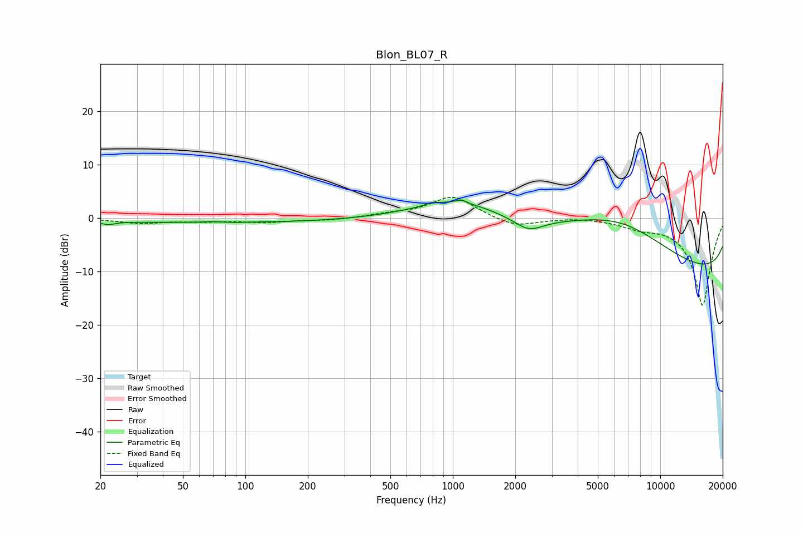

# Blon_BL07_R
See [usage instructions](https://github.com/jaakkopasanen/AutoEq#usage) for more options and info.

### Parametric EQs
Apply preamp of -3.5 dB when using parametric equalizer.

|   # | Type    |   Fc (Hz) |    Q |   Gain (dB) |
|-----|---------|-----------|------|-------------|
|   1 | Peaking |        22 | 4.59 |        -0.6 |
|   2 | Peaking |        67 | 4.6  |         0.2 |
|   3 | Peaking |        71 | 0.18 |        -0.8 |
|   4 | Peaking |        91 | 5.91 |        -0.1 |
|   5 | Peaking |       789 | 5.92 |         0.4 |
|   6 | Peaking |      1052 | 0.69 |         4   |
|   7 | Peaking |      1099 | 5.61 |         0.6 |
|   8 | Peaking |      2320 | 1.99 |        -2.4 |
|   9 | Peaking |      6397 | 0.35 |        14.2 |
|  10 | Peaking |     10000 | 0.18 |       -16.4 |

### Fixed Band EQs
When using fixed band (also called graphic) equalizer, apply preamp of **-4.0 dB** (if available) and set gains manually with these parameters.

|   # | Type    |   Fc (Hz) |    Q |   Gain (dB) |
|-----|---------|-----------|------|-------------|
|   1 | Peaking |        31 | 1.41 |        -0.9 |
|   2 | Peaking |        62 | 1.41 |        -0.5 |
|   3 | Peaking |       125 | 1.41 |        -0.7 |
|   4 | Peaking |       250 | 1.41 |        -0.4 |
|   5 | Peaking |       500 | 1.41 |         0.6 |
|   6 | Peaking |      1000 | 1.41 |         4.1 |
|   7 | Peaking |      2000 | 1.41 |        -1.7 |
|   8 | Peaking |      4000 | 1.41 |         0.3 |
|   9 | Peaking |      8000 | 1.41 |        -1.3 |
|  10 | Peaking |     16000 | 1.41 |       -16.4 |

### Graphs

