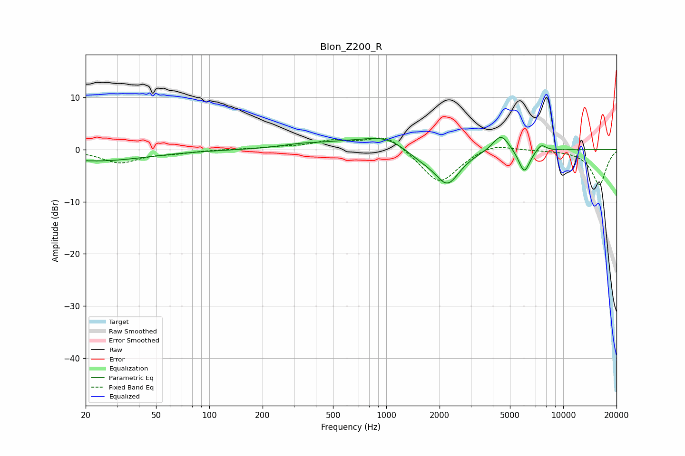

# Blon_Z200_R
See [usage instructions](https://github.com/jaakkopasanen/AutoEq#usage) for more options and info.

### Parametric EQs
Apply preamp of -2.4 dB when using parametric equalizer.

|   # | Type    |   Fc (Hz) |    Q |   Gain (dB) |
|-----|---------|-----------|------|-------------|
|   1 | Peaking |        23 | 0.49 |        -2.2 |
|   2 | Peaking |       333 | 1.13 |         0.7 |
|   3 | Peaking |       630 | 1.02 |         1.6 |
|   4 | Peaking |       674 | 1.14 |        -1   |
|   5 | Peaking |       991 | 1.03 |         2.7 |
|   6 | Peaking |      1571 | 1.36 |        -1.8 |
|   7 | Peaking |      2219 | 1.99 |        -6.3 |
|   8 | Peaking |      4449 | 3    |         3.4 |
|   9 | Peaking |      6021 | 4.26 |        -4.6 |
|  10 | Peaking |      7506 | 4.81 |         1.4 |

### Fixed Band EQs
When using fixed band (also called graphic) equalizer, apply preamp of **-2.3 dB** (if available) and set gains manually with these parameters.

|   # | Type    |   Fc (Hz) |    Q |   Gain (dB) |
|-----|---------|-----------|------|-------------|
|   1 | Peaking |        31 | 1.41 |        -2.5 |
|   2 | Peaking |        62 | 1.41 |        -0.6 |
|   3 | Peaking |       125 | 1.41 |         0   |
|   4 | Peaking |       250 | 1.41 |         0.4 |
|   5 | Peaking |       500 | 1.41 |         1.5 |
|   6 | Peaking |      1000 | 1.41 |         3   |
|   7 | Peaking |      2000 | 1.41 |        -6.7 |
|   8 | Peaking |      4000 | 1.41 |         1.5 |
|   9 | Peaking |      8000 | 1.41 |        -0   |
|  10 | Peaking |     16000 | 1.41 |        -6.7 |

### Graphs

