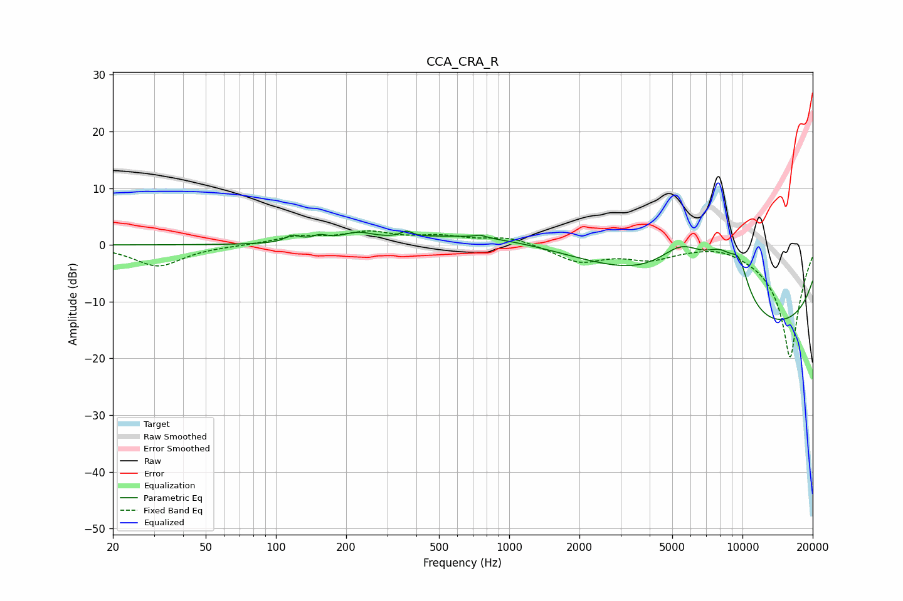

# CCA_CRA_R
See [usage instructions](https://github.com/jaakkopasanen/AutoEq#usage) for more options and info.

### Parametric EQs
Apply preamp of -2.5 dB when using parametric equalizer.

|   # | Type    |   Fc (Hz) |    Q |   Gain (dB) |
|-----|---------|-----------|------|-------------|
|   1 | Peaking |       118 | 4.55 |         1.2 |
|   2 | Peaking |       154 | 4.23 |         0.9 |
|   3 | Peaking |       224 | 2.12 |         1.5 |
|   4 | Peaking |       363 | 5.99 |         1   |
|   5 | Peaking |       752 | 5.95 |         0.5 |
|   6 | Peaking |      2317 | 0.2  |         4.8 |
|   7 | Peaking |      5512 | 1.21 |         7.8 |
|   8 | Peaking |      8091 | 1.52 |         7.7 |
|   9 | Peaking |      9676 | 3.15 |         5.4 |
|  10 | Peaking |     10000 | 0.18 |       -17.1 |

### Fixed Band EQs
When using fixed band (also called graphic) equalizer, apply preamp of **-2.6 dB** (if available) and set gains manually with these parameters.

|   # | Type    |   Fc (Hz) |    Q |   Gain (dB) |
|-----|---------|-----------|------|-------------|
|   1 | Peaking |        31 | 1.41 |        -3.8 |
|   2 | Peaking |        62 | 1.41 |        -0.1 |
|   3 | Peaking |       125 | 1.41 |         1.4 |
|   4 | Peaking |       250 | 1.41 |         2   |
|   5 | Peaking |       500 | 1.41 |         1.3 |
|   6 | Peaking |      1000 | 1.41 |         1.4 |
|   7 | Peaking |      2000 | 1.41 |        -2.9 |
|   8 | Peaking |      4000 | 1.41 |        -2.1 |
|   9 | Peaking |      8000 | 1.41 |         0.9 |
|  10 | Peaking |     16000 | 1.41 |       -20   |

### Graphs

