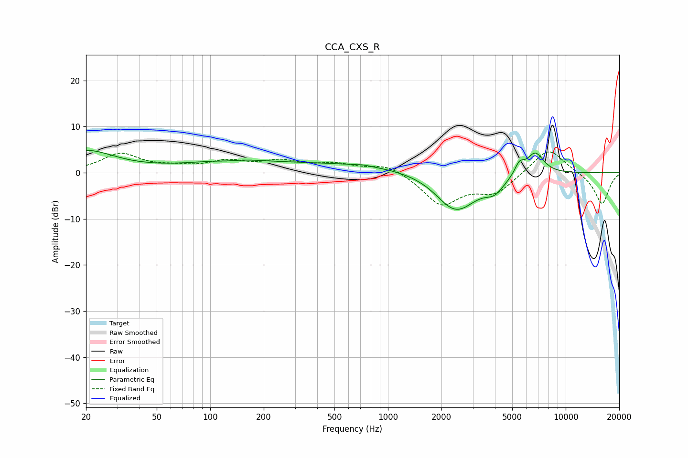

# CCA_CXS_R
See [usage instructions](https://github.com/jaakkopasanen/AutoEq#usage) for more options and info.

### Parametric EQs
Apply preamp of -4.9 dB when using parametric equalizer.

|   # | Type    |   Fc (Hz) |    Q |   Gain (dB) |
|-----|---------|-----------|------|-------------|
|   1 | Peaking |        20 | 0.88 |         4.6 |
|   2 | Peaking |       126 | 1.54 |        -1.7 |
|   3 | Peaking |       128 | 1.19 |         2.3 |
|   4 | Peaking |       325 | 0.18 |         2.2 |
|   5 | Peaking |       718 | 2.97 |         0.3 |
|   6 | Peaking |      2153 | 1.92 |        -1   |
|   7 | Peaking |      2469 | 1.2  |        -7.8 |
|   8 | Peaking |      3985 | 2.65 |        -2.6 |
|   9 | Peaking |      5492 | 5.11 |         2.5 |
|  10 | Peaking |      6736 | 2.77 |         4.8 |

### Fixed Band EQs
When using fixed band (also called graphic) equalizer, apply preamp of **-4.6 dB** (if available) and set gains manually with these parameters.

|   # | Type    |   Fc (Hz) |    Q |   Gain (dB) |
|-----|---------|-----------|------|-------------|
|   1 | Peaking |        31 | 1.41 |         4   |
|   2 | Peaking |        62 | 1.41 |         0.9 |
|   3 | Peaking |       125 | 1.41 |         2.2 |
|   4 | Peaking |       250 | 1.41 |         2.2 |
|   5 | Peaking |       500 | 1.41 |         1.7 |
|   6 | Peaking |      1000 | 1.41 |         2   |
|   7 | Peaking |      2000 | 1.41 |        -6.8 |
|   8 | Peaking |      4000 | 1.41 |        -4.1 |
|   9 | Peaking |      8000 | 1.41 |         5.7 |
|  10 | Peaking |     16000 | 1.41 |        -6.9 |

### Graphs

