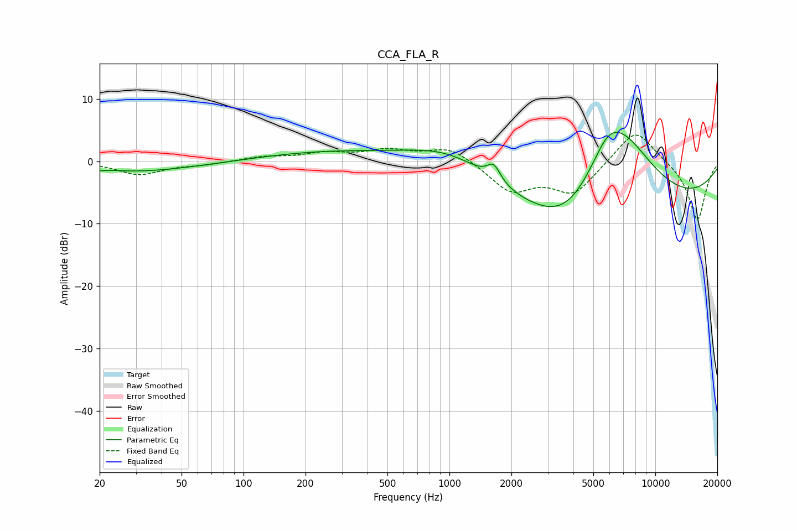

# CCA_FLA_R
See [usage instructions](https://github.com/jaakkopasanen/AutoEq#usage) for more options and info.

### Parametric EQs
Apply preamp of -4.8 dB when using parametric equalizer.

|   # | Type    |   Fc (Hz) |    Q |   Gain (dB) |
|-----|---------|-----------|------|-------------|
|   1 | Peaking |        23 | 2.06 |         0.3 |
|   2 | Peaking |        25 | 0.39 |        -1.8 |
|   3 | Peaking |       272 | 0.4  |         1.6 |
|   4 | Peaking |       992 | 0.68 |         4.2 |
|   5 | Peaking |      1222 | 1.05 |         0.3 |
|   6 | Peaking |      1643 | 4.36 |         2.6 |
|   7 | Peaking |      3694 | 0.88 |        -4.5 |
|   8 | Peaking |      5898 | 1.42 |         6.6 |
|   9 | Peaking |      6092 | 0.18 |        -9.6 |
|  10 | Peaking |      7217 | 0.73 |        10.5 |

### Fixed Band EQs
When using fixed band (also called graphic) equalizer, apply preamp of **-4.3 dB** (if available) and set gains manually with these parameters.

|   # | Type    |   Fc (Hz) |    Q |   Gain (dB) |
|-----|---------|-----------|------|-------------|
|   1 | Peaking |        31 | 1.41 |        -2.1 |
|   2 | Peaking |        62 | 1.41 |        -0.5 |
|   3 | Peaking |       125 | 1.41 |         0.7 |
|   4 | Peaking |       250 | 1.41 |         1.2 |
|   5 | Peaking |       500 | 1.41 |         1.6 |
|   6 | Peaking |      1000 | 1.41 |         2.4 |
|   7 | Peaking |      2000 | 1.41 |        -4.6 |
|   8 | Peaking |      4000 | 1.41 |        -5   |
|   9 | Peaking |      8000 | 1.41 |         5.6 |
|  10 | Peaking |     16000 | 1.41 |        -9.6 |

### Graphs

