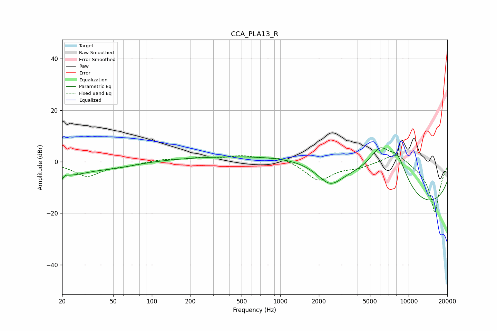

# CCA_PLA13_R
See [usage instructions](https://github.com/jaakkopasanen/AutoEq#usage) for more options and info.

### Parametric EQs
Apply preamp of -5.5 dB when using parametric equalizer.

|   # | Type    |   Fc (Hz) |    Q |   Gain (dB) |
|-----|---------|-----------|------|-------------|
|   1 | Peaking |        20 | 5.08 |        -4.8 |
|   2 | Peaking |        21 | 5.87 |         3   |
|   3 | Peaking |        23 | 0.9  |        -4.3 |
|   4 | Peaking |        52 | 0.81 |        -1.7 |
|   5 | Peaking |       676 | 0.18 |         2.1 |
|   6 | Peaking |      2374 | 0.38 |         6.9 |
|   7 | Peaking |      2441 | 1.31 |        -8.7 |
|   8 | Peaking |      5990 | 1.19 |        14.7 |
|   9 | Peaking |      8209 | 1.52 |        11.9 |
|  10 | Peaking |     10000 | 0.18 |       -20   |

### Fixed Band EQs
When using fixed band (also called graphic) equalizer, apply preamp of **-2.5 dB** (if available) and set gains manually with these parameters.

|   # | Type    |   Fc (Hz) |    Q |   Gain (dB) |
|-----|---------|-----------|------|-------------|
|   1 | Peaking |        31 | 1.41 |        -5.5 |
|   2 | Peaking |        62 | 1.41 |        -1.1 |
|   3 | Peaking |       125 | 1.41 |         0.9 |
|   4 | Peaking |       250 | 1.41 |         1.4 |
|   5 | Peaking |       500 | 1.41 |         2   |
|   6 | Peaking |      1000 | 1.41 |         2.1 |
|   7 | Peaking |      2000 | 1.41 |        -7.3 |
|   8 | Peaking |      4000 | 1.41 |        -1.8 |
|   9 | Peaking |      8000 | 1.41 |         4.6 |
|  10 | Peaking |     16000 | 1.41 |       -20   |

### Graphs

