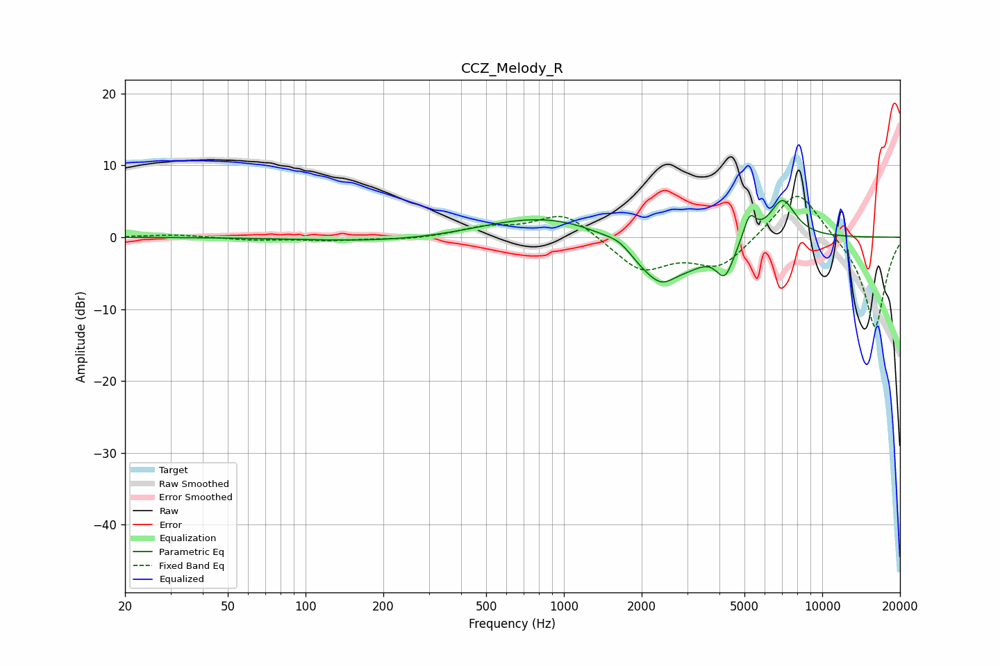

# CCZ_Melody_R
See [usage instructions](https://github.com/jaakkopasanen/AutoEq#usage) for more options and info.

### Parametric EQs
Apply preamp of -5.2 dB when using parametric equalizer.

|   # | Type    |   Fc (Hz) |    Q |   Gain (dB) |
|-----|---------|-----------|------|-------------|
|   1 | Peaking |       220 | 0.46 |        -0.7 |
|   2 | Peaking |       588 | 1.02 |         0.2 |
|   3 | Peaking |       940 | 0.55 |         3.3 |
|   4 | Peaking |      1649 | 2.69 |         1.2 |
|   5 | Peaking |      2263 | 1.15 |        -6.4 |
|   6 | Peaking |      2407 | 3.3  |        -1   |
|   7 | Peaking |      3123 | 2.28 |        -1   |
|   8 | Peaking |      4202 | 3.96 |        -4.5 |
|   9 | Peaking |      5234 | 5.61 |         3.5 |
|  10 | Peaking |      7013 | 2.63 |         5.5 |

### Fixed Band EQs
When using fixed band (also called graphic) equalizer, apply preamp of **-5.8 dB** (if available) and set gains manually with these parameters.

|   # | Type    |   Fc (Hz) |    Q |   Gain (dB) |
|-----|---------|-----------|------|-------------|
|   1 | Peaking |        31 | 1.41 |         0.4 |
|   2 | Peaking |        62 | 1.41 |        -0.4 |
|   3 | Peaking |       125 | 1.41 |        -0.4 |
|   4 | Peaking |       250 | 1.41 |        -0.3 |
|   5 | Peaking |       500 | 1.41 |         1.2 |
|   6 | Peaking |      1000 | 1.41 |         3.5 |
|   7 | Peaking |      2000 | 1.41 |        -4.6 |
|   8 | Peaking |      4000 | 1.41 |        -4.2 |
|   9 | Peaking |      8000 | 1.41 |         7.2 |
|  10 | Peaking |     16000 | 1.41 |       -12.9 |

### Graphs

