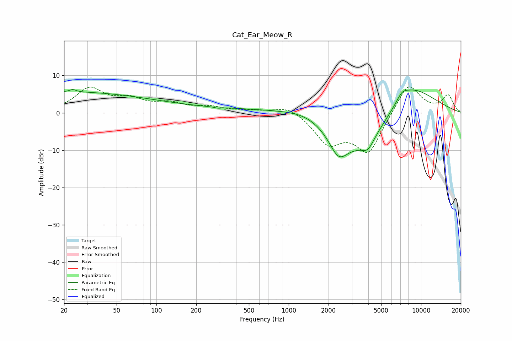

# Cat_Ear_Meow_R
See [usage instructions](https://github.com/jaakkopasanen/AutoEq#usage) for more options and info.

### Parametric EQs
Apply preamp of -6.3 dB when using parametric equalizer.

|   # | Type    |   Fc (Hz) |    Q |   Gain (dB) |
|-----|---------|-----------|------|-------------|
|   1 | Peaking |        20 | 0.2  |         5.5 |
|   2 | Peaking |        23 | 5.99 |         0.7 |
|   3 | Peaking |       292 | 5.92 |        -0.3 |
|   4 | Peaking |       420 | 0.23 |         1   |
|   5 | Peaking |      1386 | 0.83 |         2   |
|   6 | Peaking |      2378 | 1.96 |        -6.5 |
|   7 | Peaking |      3690 | 0.6  |       -11   |
|   8 | Peaking |      3971 | 3.31 |        -2.6 |
|   9 | Peaking |      7176 | 3.31 |         1.8 |
|  10 | Peaking |      8062 | 0.66 |         9.9 |

### Fixed Band EQs
When using fixed band (also called graphic) equalizer, apply preamp of **-7.1 dB** (if available) and set gains manually with these parameters.

|   # | Type    |   Fc (Hz) |    Q |   Gain (dB) |
|-----|---------|-----------|------|-------------|
|   1 | Peaking |        31 | 1.41 |         6.2 |
|   2 | Peaking |        62 | 1.41 |         3   |
|   3 | Peaking |       125 | 1.41 |         2.2 |
|   4 | Peaking |       250 | 1.41 |         1.3 |
|   5 | Peaking |       500 | 1.41 |         0.5 |
|   6 | Peaking |      1000 | 1.41 |         2.2 |
|   7 | Peaking |      2000 | 1.41 |        -7.5 |
|   8 | Peaking |      4000 | 1.41 |       -10.6 |
|   9 | Peaking |      8000 | 1.41 |         8.6 |
|  10 | Peaking |     16000 | 1.41 |         4.5 |

### Graphs

