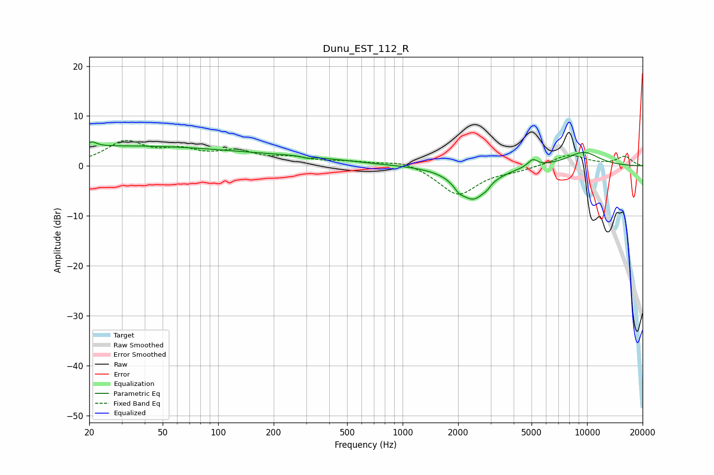

# Dunu_EST_112_R
See [usage instructions](https://github.com/jaakkopasanen/AutoEq#usage) for more options and info.

### Parametric EQs
Apply preamp of -4.9 dB when using parametric equalizer.

|   # | Type    |   Fc (Hz) |    Q |   Gain (dB) |
|-----|---------|-----------|------|-------------|
|   1 | Peaking |        21 | 5.66 |         0.9 |
|   2 | Peaking |        30 | 0.2  |         3.9 |
|   3 | Peaking |       290 | 0.53 |         1.2 |
|   4 | Peaking |       304 | 5.91 |        -0.4 |
|   5 | Peaking |      2019 | 5.7  |        -1   |
|   6 | Peaking |      2416 | 1.75 |        -6.6 |
|   7 | Peaking |      2901 | 5.85 |        -1.7 |
|   8 | Peaking |      2934 | 4.97 |         1.4 |
|   9 | Peaking |      5074 | 5.25 |         1.5 |
|  10 | Peaking |      9547 | 1.36 |         2.8 |

### Fixed Band EQs
When using fixed band (also called graphic) equalizer, apply preamp of **-5.2 dB** (if available) and set gains manually with these parameters.

|   # | Type    |   Fc (Hz) |    Q |   Gain (dB) |
|-----|---------|-----------|------|-------------|
|   1 | Peaking |        31 | 1.41 |         4.5 |
|   2 | Peaking |        62 | 1.41 |         2.5 |
|   3 | Peaking |       125 | 1.41 |         2.5 |
|   4 | Peaking |       250 | 1.41 |         1.3 |
|   5 | Peaking |       500 | 1.41 |         0.7 |
|   6 | Peaking |      1000 | 1.41 |         1.2 |
|   7 | Peaking |      2000 | 1.41 |        -5.8 |
|   8 | Peaking |      4000 | 1.41 |        -0.7 |
|   9 | Peaking |      8000 | 1.41 |         2.3 |
|  10 | Peaking |     16000 | 1.41 |         1.8 |

### Graphs

