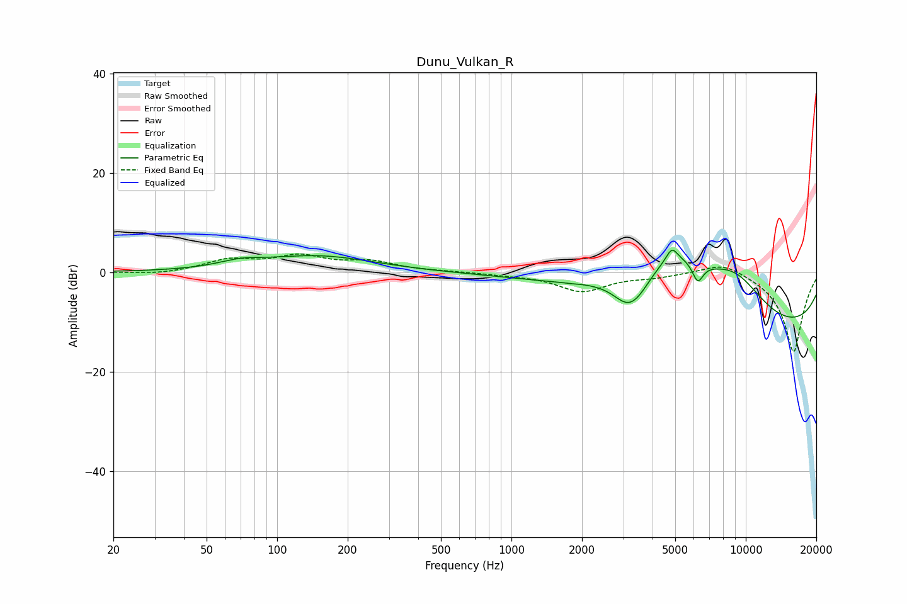

# Dunu_Vulkan_R
See [usage instructions](https://github.com/jaakkopasanen/AutoEq#usage) for more options and info.

### Parametric EQs
Apply preamp of -4.5 dB when using parametric equalizer.

|   # | Type    |   Fc (Hz) |    Q |   Gain (dB) |
|-----|---------|-----------|------|-------------|
|   1 | Peaking |        70 | 1.57 |         1.2 |
|   2 | Peaking |       149 | 0.59 |         3.2 |
|   3 | Peaking |      1758 | 5.8  |        -0.1 |
|   4 | Peaking |      3122 | 2.19 |        -4.7 |
|   5 | Peaking |      3489 | 2.31 |        -2.6 |
|   6 | Peaking |      4839 | 6    |         2.5 |
|   7 | Peaking |      4924 | 0.67 |        13.1 |
|   8 | Peaking |      6238 | 5.82 |        -4   |
|   9 | Peaking |      9078 | 0.95 |         7.4 |
|  10 | Peaking |     10000 | 0.19 |       -13.6 |

### Fixed Band EQs
When using fixed band (also called graphic) equalizer, apply preamp of **-3.8 dB** (if available) and set gains manually with these parameters.

|   # | Type    |   Fc (Hz) |    Q |   Gain (dB) |
|-----|---------|-----------|------|-------------|
|   1 | Peaking |        31 | 1.41 |        -0.5 |
|   2 | Peaking |        62 | 1.41 |         2.3 |
|   3 | Peaking |       125 | 1.41 |         2.9 |
|   4 | Peaking |       250 | 1.41 |         1.9 |
|   5 | Peaking |       500 | 1.41 |         0.1 |
|   6 | Peaking |      1000 | 1.41 |        -0.4 |
|   7 | Peaking |      2000 | 1.41 |        -3.7 |
|   8 | Peaking |      4000 | 1.41 |        -0.8 |
|   9 | Peaking |      8000 | 1.41 |         2.4 |
|  10 | Peaking |     16000 | 1.41 |       -16.2 |

### Graphs

