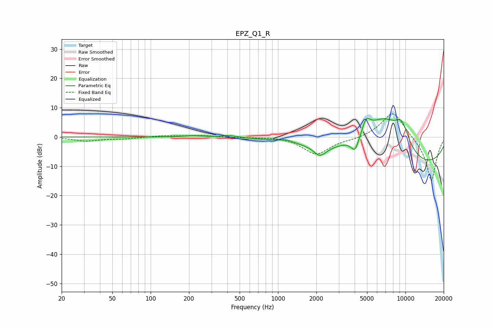

# EPZ_Q1_R
See [usage instructions](https://github.com/jaakkopasanen/AutoEq#usage) for more options and info.

### Parametric EQs
Apply preamp of -6.5 dB when using parametric equalizer.

|   # | Type    |   Fc (Hz) |    Q |   Gain (dB) |
|-----|---------|-----------|------|-------------|
|   1 | Peaking |       214 | 1.8  |         0.5 |
|   2 | Peaking |       412 | 2.36 |         0.7 |
|   3 | Peaking |      1168 | 3.19 |         0.8 |
|   4 | Peaking |      2134 | 2.81 |        -3.6 |
|   5 | Peaking |      4030 | 4.43 |        -5.1 |
|   6 | Peaking |      4931 | 4.6  |         4.2 |
|   7 | Peaking |      5289 | 0.92 |         6.4 |
|   8 | Peaking |      6987 | 1.04 |         9.5 |
|   9 | Peaking |      9376 | 2.07 |         8.7 |
|  10 | Peaking |     10000 | 0.21 |       -11.3 |

### Fixed Band EQs
When using fixed band (also called graphic) equalizer, apply preamp of **-8.0 dB** (if available) and set gains manually with these parameters.

|   # | Type    |   Fc (Hz) |    Q |   Gain (dB) |
|-----|---------|-----------|------|-------------|
|   1 | Peaking |        31 | 1.41 |        -1.3 |
|   2 | Peaking |        62 | 1.41 |        -0.6 |
|   3 | Peaking |       125 | 1.41 |         0.5 |
|   4 | Peaking |       250 | 1.41 |         0.5 |
|   5 | Peaking |       500 | 1.41 |        -0.2 |
|   6 | Peaking |      1000 | 1.41 |         0.3 |
|   7 | Peaking |      2000 | 1.41 |        -5.9 |
|   8 | Peaking |      4000 | 1.41 |        -0.7 |
|   9 | Peaking |      8000 | 1.41 |         9.3 |
|  10 | Peaking |     16000 | 1.41 |       -15.4 |

### Graphs

