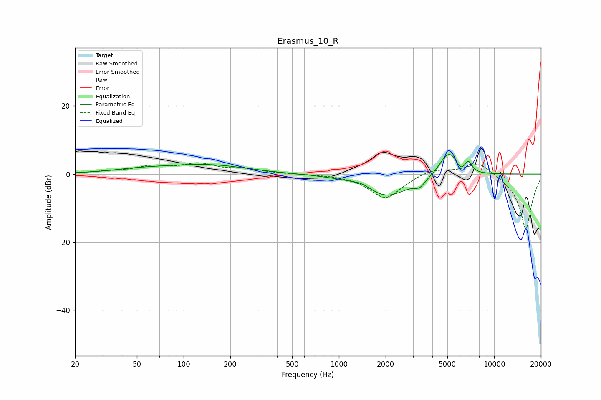

# Erasmus_10_R
See [usage instructions](https://github.com/jaakkopasanen/AutoEq#usage) for more options and info.

### Parametric EQs
Apply preamp of -5.8 dB when using parametric equalizer.

|   # | Type    |   Fc (Hz) |    Q |   Gain (dB) |
|-----|---------|-----------|------|-------------|
|   1 | Peaking |        51 | 0.83 |         0.8 |
|   2 | Peaking |       148 | 0.48 |         2.9 |
|   3 | Peaking |       299 | 0.6  |        -0.5 |
|   4 | Peaking |      1400 | 2.46 |         1.1 |
|   5 | Peaking |      2032 | 0.99 |        -6.6 |
|   6 | Peaking |      3311 | 4.14 |        -2   |
|   7 | Peaking |      4988 | 2.54 |         6.3 |
|   8 | Peaking |      5466 | 4.67 |         1.3 |
|   9 | Peaking |      6092 | 6    |        -1.2 |
|  10 | Peaking |      6815 | 6    |         3   |

### Fixed Band EQs
When using fixed band (also called graphic) equalizer, apply preamp of **-3.4 dB** (if available) and set gains manually with these parameters.

|   # | Type    |   Fc (Hz) |    Q |   Gain (dB) |
|-----|---------|-----------|------|-------------|
|   1 | Peaking |        31 | 1.41 |         0.5 |
|   2 | Peaking |        62 | 1.41 |         2   |
|   3 | Peaking |       125 | 1.41 |         2.7 |
|   4 | Peaking |       250 | 1.41 |         1.2 |
|   5 | Peaking |       500 | 1.41 |         0   |
|   6 | Peaking |      1000 | 1.41 |        -0   |
|   7 | Peaking |      2000 | 1.41 |        -7.2 |
|   8 | Peaking |      4000 | 1.41 |         1.8 |
|   9 | Peaking |      8000 | 1.41 |         3.9 |
|  10 | Peaking |     16000 | 1.41 |       -16.4 |

### Graphs

