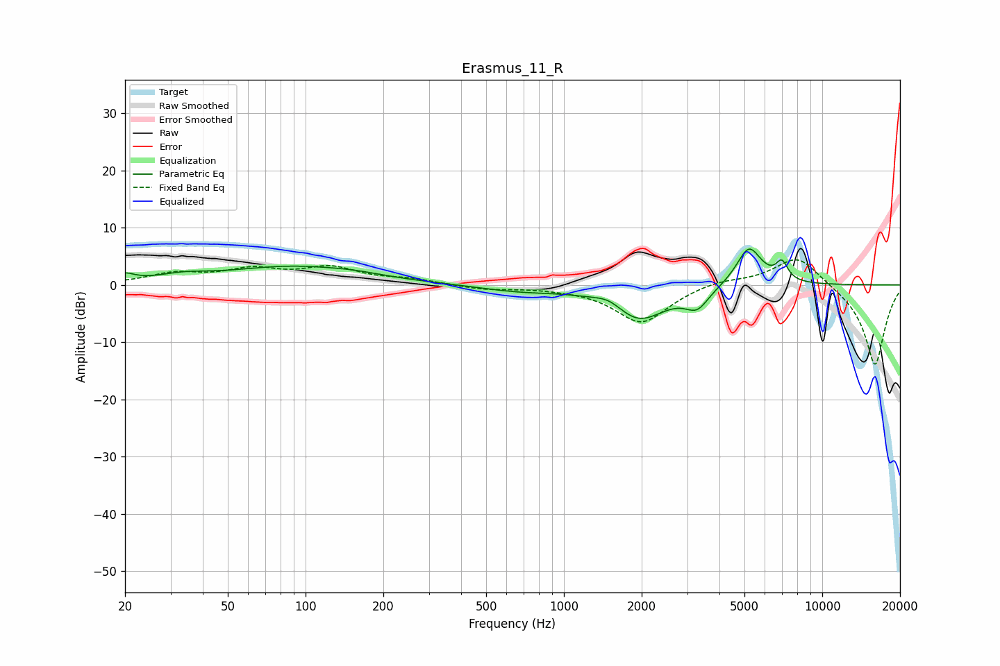

# Erasmus_11_R
See [usage instructions](https://github.com/jaakkopasanen/AutoEq#usage) for more options and info.

### Parametric EQs
Apply preamp of -6.4 dB when using parametric equalizer.

|   # | Type    |   Fc (Hz) |    Q |   Gain (dB) |
|-----|---------|-----------|------|-------------|
|   1 | Peaking |        20 | 3.92 |         1.3 |
|   2 | Peaking |        33 | 1.47 |         1   |
|   3 | Peaking |        90 | 0.54 |         3.1 |
|   4 | Peaking |       157 | 1.43 |         0.4 |
|   5 | Peaking |       670 | 0.92 |        -1   |
|   6 | Peaking |      1501 | 2.52 |         1.5 |
|   7 | Peaking |      1940 | 1.3  |        -6.1 |
|   8 | Peaking |      3278 | 3.15 |        -3.2 |
|   9 | Peaking |      5204 | 2.78 |         6.9 |
|  10 | Peaking |      6979 | 5.91 |         3.1 |

### Fixed Band EQs
When using fixed band (also called graphic) equalizer, apply preamp of **-4.5 dB** (if available) and set gains manually with these parameters.

|   # | Type    |   Fc (Hz) |    Q |   Gain (dB) |
|-----|---------|-----------|------|-------------|
|   1 | Peaking |        31 | 1.41 |         1.8 |
|   2 | Peaking |        62 | 1.41 |         2.3 |
|   3 | Peaking |       125 | 1.41 |         2.8 |
|   4 | Peaking |       250 | 1.41 |         0.9 |
|   5 | Peaking |       500 | 1.41 |        -0.7 |
|   6 | Peaking |      1000 | 1.41 |        -0.3 |
|   7 | Peaking |      2000 | 1.41 |        -6.7 |
|   8 | Peaking |      4000 | 1.41 |         1   |
|   9 | Peaking |      8000 | 1.41 |         5.4 |
|  10 | Peaking |     16000 | 1.41 |       -14.2 |

### Graphs

