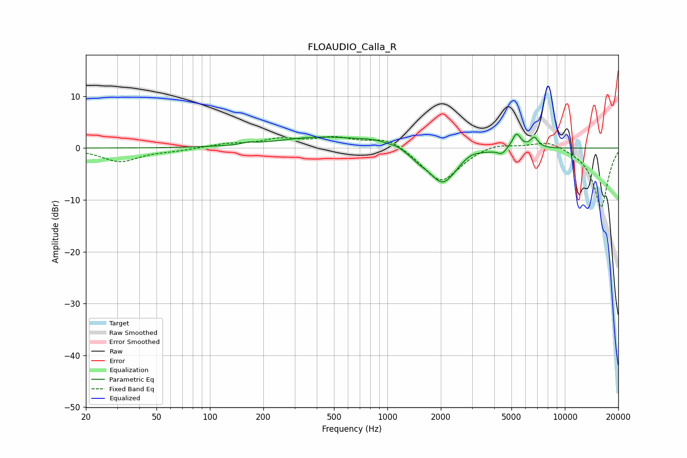

# FLOAUDIO_Calla_R
See [usage instructions](https://github.com/jaakkopasanen/AutoEq#usage) for more options and info.

### Parametric EQs
Apply preamp of -2.8 dB when using parametric equalizer.

|   # | Type    |   Fc (Hz) |    Q |   Gain (dB) |
|-----|---------|-----------|------|-------------|
|   1 | Peaking |       166 | 4.74 |         0.4 |
|   2 | Peaking |       432 | 0.55 |         2.1 |
|   3 | Peaking |       874 | 1.51 |         0.9 |
|   4 | Peaking |      1134 | 4.74 |         0.3 |
|   5 | Peaking |      1502 | 3.26 |        -0.9 |
|   6 | Peaking |      2051 | 1.76 |        -6.9 |
|   7 | Peaking |      2950 | 2.75 |         0.8 |
|   8 | Peaking |      4411 | 5.9  |        -1   |
|   9 | Peaking |      5339 | 5.71 |         3   |
|  10 | Peaking |      6724 | 6    |         2   |

### Fixed Band EQs
When using fixed band (also called graphic) equalizer, apply preamp of **-2.3 dB** (if available) and set gains manually with these parameters.

|   # | Type    |   Fc (Hz) |    Q |   Gain (dB) |
|-----|---------|-----------|------|-------------|
|   1 | Peaking |        31 | 1.41 |        -2.6 |
|   2 | Peaking |        62 | 1.41 |        -0.4 |
|   3 | Peaking |       125 | 1.41 |         0.7 |
|   4 | Peaking |       250 | 1.41 |         1.6 |
|   5 | Peaking |       500 | 1.41 |         1.8 |
|   6 | Peaking |      1000 | 1.41 |         2.2 |
|   7 | Peaking |      2000 | 1.41 |        -6.8 |
|   8 | Peaking |      4000 | 1.41 |         1.2 |
|   9 | Peaking |      8000 | 1.41 |         1.6 |
|  10 | Peaking |     16000 | 1.41 |       -11.5 |

### Graphs

