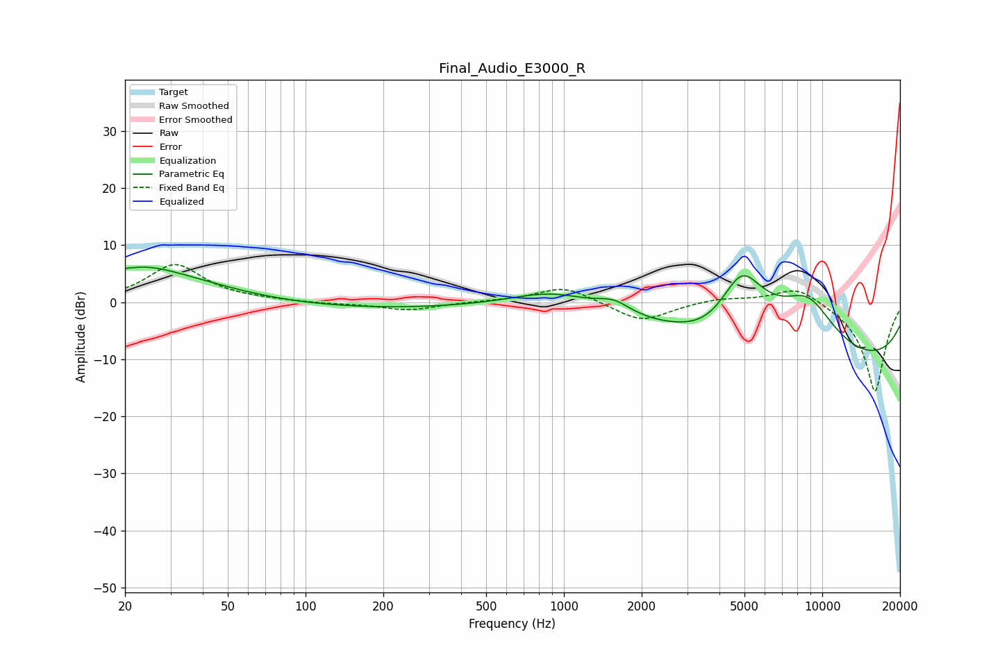

# Final_Audio_E3000_R
See [usage instructions](https://github.com/jaakkopasanen/AutoEq#usage) for more options and info.

### Parametric EQs
Apply preamp of -6.3 dB when using parametric equalizer.

|   # | Type    |   Fc (Hz) |    Q |   Gain (dB) |
|-----|---------|-----------|------|-------------|
|   1 | Peaking |        22 | 5.9  |        -0.1 |
|   2 | Peaking |        22 | 1.01 |         2.2 |
|   3 | Peaking |        27 | 0.48 |         5.1 |
|   4 | Peaking |        94 | 0.18 |        -1.4 |
|   5 | Peaking |       919 | 0.86 |         3.1 |
|   6 | Peaking |      1559 | 2.16 |         2.1 |
|   7 | Peaking |      3676 | 1.31 |        -2.3 |
|   8 | Peaking |      4878 | 1.33 |        13   |
|   9 | Peaking |      8793 | 1.06 |         9.6 |
|  10 | Peaking |     10000 | 0.18 |       -11.7 |

### Fixed Band EQs
When using fixed band (also called graphic) equalizer, apply preamp of **-6.7 dB** (if available) and set gains manually with these parameters.

|   # | Type    |   Fc (Hz) |    Q |   Gain (dB) |
|-----|---------|-----------|------|-------------|
|   1 | Peaking |        31 | 1.41 |         6.6 |
|   2 | Peaking |        62 | 1.41 |         0.2 |
|   3 | Peaking |       125 | 1.41 |        -0.3 |
|   4 | Peaking |       250 | 1.41 |        -1.4 |
|   5 | Peaking |       500 | 1.41 |         0.1 |
|   6 | Peaking |      1000 | 1.41 |         2.8 |
|   7 | Peaking |      2000 | 1.41 |        -3.5 |
|   8 | Peaking |      4000 | 1.41 |         0.8 |
|   9 | Peaking |      8000 | 1.41 |         3   |
|  10 | Peaking |     16000 | 1.41 |       -15.8 |

### Graphs

