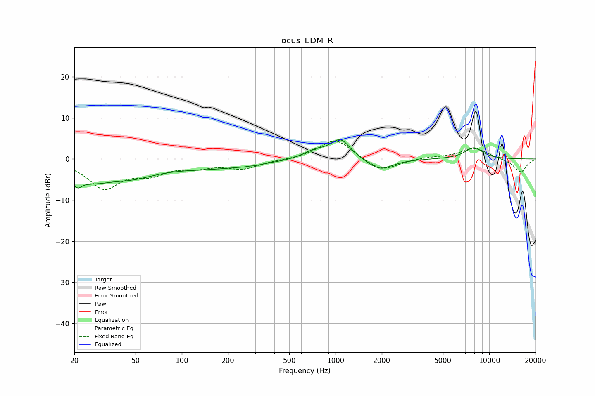

# Focus_EDM_R
See [usage instructions](https://github.com/jaakkopasanen/AutoEq#usage) for more options and info.

### Parametric EQs
Apply preamp of -4.8 dB when using parametric equalizer.

|   # | Type    |   Fc (Hz) |    Q |   Gain (dB) |
|-----|---------|-----------|------|-------------|
|   1 | Peaking |        21 | 4.89 |        -2.4 |
|   2 | Peaking |        25 | 0.98 |        -4.2 |
|   3 | Peaking |        48 | 0.87 |        -2.9 |
|   4 | Peaking |       160 | 0.48 |        -2   |
|   5 | Peaking |       275 | 4.41 |         2.3 |
|   6 | Peaking |       276 | 4.05 |        -2.5 |
|   7 | Peaking |       731 | 1.86 |         1.8 |
|   8 | Peaking |      1076 | 2.18 |         4.8 |
|   9 | Peaking |      1945 | 1.74 |        -2.8 |
|  10 | Peaking |      7943 | 2.21 |         2.8 |

### Fixed Band EQs
When using fixed band (also called graphic) equalizer, apply preamp of **-4.4 dB** (if available) and set gains manually with these parameters.

|   # | Type    |   Fc (Hz) |    Q |   Gain (dB) |
|-----|---------|-----------|------|-------------|
|   1 | Peaking |        31 | 1.41 |        -6.8 |
|   2 | Peaking |        62 | 1.41 |        -3   |
|   3 | Peaking |       125 | 1.41 |        -1.5 |
|   4 | Peaking |       250 | 1.41 |        -2.2 |
|   5 | Peaking |       500 | 1.41 |        -0.1 |
|   6 | Peaking |      1000 | 1.41 |         5   |
|   7 | Peaking |      2000 | 1.41 |        -3.2 |
|   8 | Peaking |      4000 | 1.41 |         0.4 |
|   9 | Peaking |      8000 | 1.41 |         2.7 |
|  10 | Peaking |     16000 | 1.41 |        -3.3 |

### Graphs

