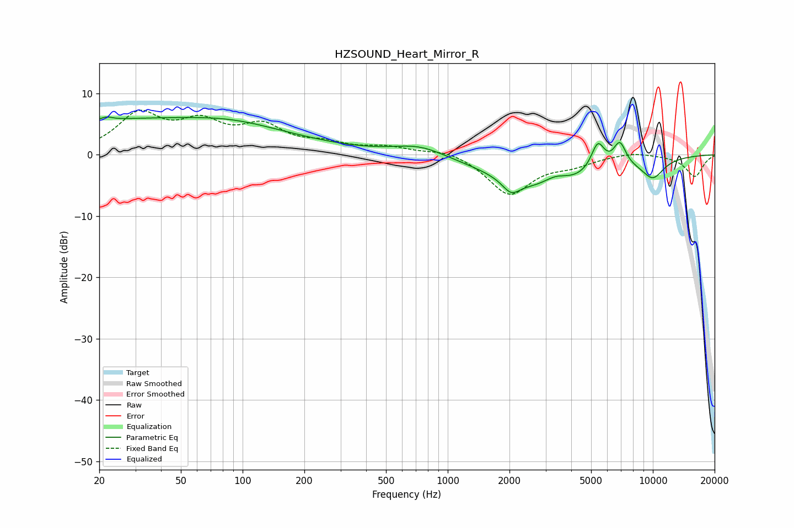

# HZSOUND_Heart_Mirror_R
See [usage instructions](https://github.com/jaakkopasanen/AutoEq#usage) for more options and info.

### Parametric EQs
Apply preamp of -6.3 dB when using parametric equalizer.

|   # | Type    |   Fc (Hz) |    Q |   Gain (dB) |
|-----|---------|-----------|------|-------------|
|   1 | Peaking |        22 | 5.37 |         0.5 |
|   2 | Peaking |        34 | 0.18 |         5.7 |
|   3 | Peaking |        88 | 0.73 |         0.8 |
|   4 | Peaking |       729 | 1.12 |         1.8 |
|   5 | Peaking |      2036 | 3.37 |        -2.2 |
|   6 | Peaking |      3000 | 0.58 |        -5.6 |
|   7 | Peaking |      3356 | 2.17 |         1.8 |
|   8 | Peaking |      5391 | 4.12 |         4.6 |
|   9 | Peaking |      6895 | 4.33 |         4   |
|  10 | Peaking |     10000 | 2.24 |        -3.1 |

### Fixed Band EQs
When using fixed band (also called graphic) equalizer, apply preamp of **-7.4 dB** (if available) and set gains manually with these parameters.

|   # | Type    |   Fc (Hz) |    Q |   Gain (dB) |
|-----|---------|-----------|------|-------------|
|   1 | Peaking |        31 | 1.41 |         6.2 |
|   2 | Peaking |        62 | 1.41 |         4.4 |
|   3 | Peaking |       125 | 1.41 |         4.1 |
|   4 | Peaking |       250 | 1.41 |         1.4 |
|   5 | Peaking |       500 | 1.41 |         1.1 |
|   6 | Peaking |      1000 | 1.41 |         1   |
|   7 | Peaking |      2000 | 1.41 |        -6.5 |
|   8 | Peaking |      4000 | 1.41 |        -1.3 |
|   9 | Peaking |      8000 | 1.41 |         0.6 |
|  10 | Peaking |     16000 | 1.41 |        -3.6 |

### Graphs

