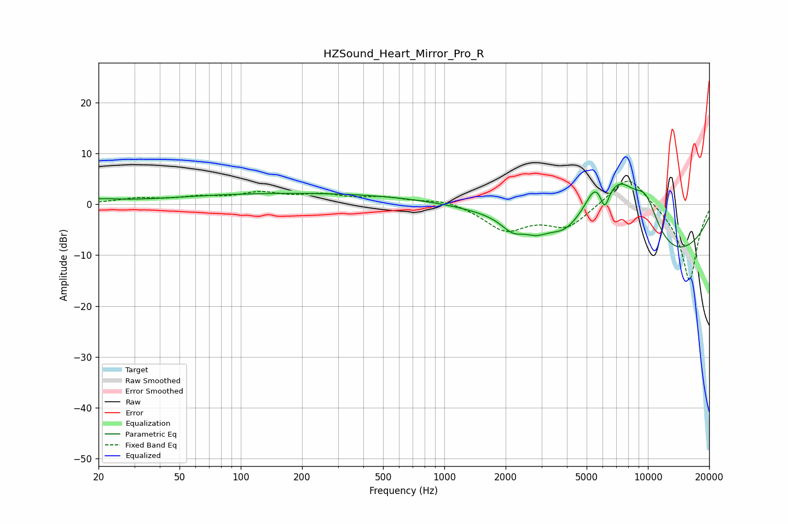

# HZSound_Heart_Mirror_Pro_R
See [usage instructions](https://github.com/jaakkopasanen/AutoEq#usage) for more options and info.

### Parametric EQs
Apply preamp of -4.1 dB when using parametric equalizer.

|   # | Type    |   Fc (Hz) |    Q |   Gain (dB) |
|-----|---------|-----------|------|-------------|
|   1 | Peaking |        20 | 1.48 |         0.7 |
|   2 | Peaking |       199 | 0.21 |         2.2 |
|   3 | Peaking |      2167 | 2.56 |        -2.5 |
|   4 | Peaking |      2833 | 2.55 |        -1.8 |
|   5 | Peaking |      3859 | 2.14 |        -1.9 |
|   6 | Peaking |      5529 | 2.68 |         5.3 |
|   7 | Peaking |      6125 | 5.98 |        -4.6 |
|   8 | Peaking |      7246 | 1.02 |        13.8 |
|   9 | Peaking |      9761 | 1.68 |         8.7 |
|  10 | Peaking |     10000 | 0.33 |       -15.2 |

### Fixed Band EQs
When using fixed band (also called graphic) equalizer, apply preamp of **-4.6 dB** (if available) and set gains manually with these parameters.

|   # | Type    |   Fc (Hz) |    Q |   Gain (dB) |
|-----|---------|-----------|------|-------------|
|   1 | Peaking |        31 | 1.41 |         1   |
|   2 | Peaking |        62 | 1.41 |         1.2 |
|   3 | Peaking |       125 | 1.41 |         2   |
|   4 | Peaking |       250 | 1.41 |         1.6 |
|   5 | Peaking |       500 | 1.41 |         1.2 |
|   6 | Peaking |      1000 | 1.41 |         1   |
|   7 | Peaking |      2000 | 1.41 |        -4.9 |
|   8 | Peaking |      4000 | 1.41 |        -4.4 |
|   9 | Peaking |      8000 | 1.41 |         6.4 |
|  10 | Peaking |     16000 | 1.41 |       -15.3 |

### Graphs

