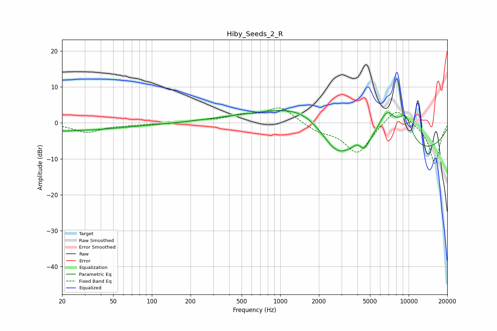

# Hiby_Seeds_2_R
See [usage instructions](https://github.com/jaakkopasanen/AutoEq#usage) for more options and info.

### Parametric EQs
Apply preamp of -3.5 dB when using parametric equalizer.

|   # | Type    |   Fc (Hz) |    Q |   Gain (dB) |
|-----|---------|-----------|------|-------------|
|   1 | Peaking |        21 | 5.84 |        -0.2 |
|   2 | Peaking |        57 | 0.18 |        -3   |
|   3 | Peaking |       247 | 0.18 |         2.7 |
|   4 | Peaking |      1560 | 0.61 |         6   |
|   5 | Peaking |      2733 | 1.21 |        -6.5 |
|   6 | Peaking |      3960 | 4.83 |         1   |
|   7 | Peaking |      4531 | 4.15 |        -2.3 |
|   8 | Peaking |      6761 | 1.58 |        10.6 |
|   9 | Peaking |      8304 | 0.23 |        -9.6 |
|  10 | Peaking |      9435 | 2.21 |         7.6 |

### Fixed Band EQs
When using fixed band (also called graphic) equalizer, apply preamp of **-4.3 dB** (if available) and set gains manually with these parameters.

|   # | Type    |   Fc (Hz) |    Q |   Gain (dB) |
|-----|---------|-----------|------|-------------|
|   1 | Peaking |        31 | 1.41 |        -2.6 |
|   2 | Peaking |        62 | 1.41 |        -0.4 |
|   3 | Peaking |       125 | 1.41 |        -0.2 |
|   4 | Peaking |       250 | 1.41 |         0.6 |
|   5 | Peaking |       500 | 1.41 |         1.8 |
|   6 | Peaking |      1000 | 1.41 |         4.4 |
|   7 | Peaking |      2000 | 1.41 |        -2   |
|   8 | Peaking |      4000 | 1.41 |        -8.6 |
|   9 | Peaking |      8000 | 1.41 |         5   |
|  10 | Peaking |     16000 | 1.41 |       -11.6 |

### Graphs

