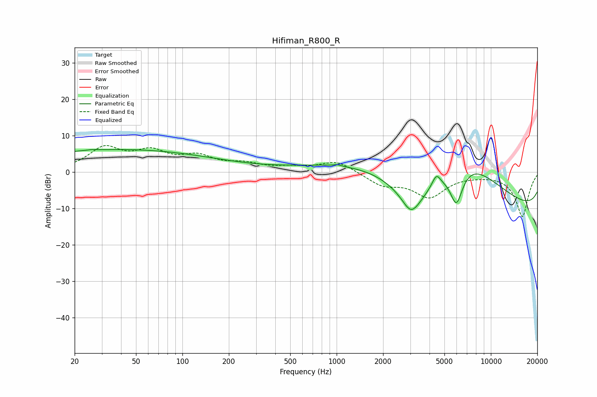

# Hifiman_R800_R
See [usage instructions](https://github.com/jaakkopasanen/AutoEq#usage) for more options and info.

### Parametric EQs
Apply preamp of -6.3 dB when using parametric equalizer.

|   # | Type    |   Fc (Hz) |    Q |   Gain (dB) |
|-----|---------|-----------|------|-------------|
|   1 | Peaking |        26 | 5.58 |         0.2 |
|   2 | Peaking |        38 | 0.21 |         6.1 |
|   3 | Peaking |      1007 | 5.71 |         0.4 |
|   4 | Peaking |      3021 | 2.96 |        -3.1 |
|   5 | Peaking |      3160 | 0.92 |       -13.2 |
|   6 | Peaking |      3339 | 0.22 |         6.3 |
|   7 | Peaking |      4432 | 5.43 |         3   |
|   8 | Peaking |      5978 | 2.61 |       -13.2 |
|   9 | Peaking |      6272 | 0.44 |        20   |
|  10 | Peaking |      9909 | 0.18 |       -17.6 |

### Fixed Band EQs
When using fixed band (also called graphic) equalizer, apply preamp of **-7.4 dB** (if available) and set gains manually with these parameters.

|   # | Type    |   Fc (Hz) |    Q |   Gain (dB) |
|-----|---------|-----------|------|-------------|
|   1 | Peaking |        31 | 1.41 |         6.2 |
|   2 | Peaking |        62 | 1.41 |         4.7 |
|   3 | Peaking |       125 | 1.41 |         3.7 |
|   4 | Peaking |       250 | 1.41 |         1.8 |
|   5 | Peaking |       500 | 1.41 |         1   |
|   6 | Peaking |      1000 | 1.41 |         3.1 |
|   7 | Peaking |      2000 | 1.41 |        -3.3 |
|   8 | Peaking |      4000 | 1.41 |        -6.5 |
|   9 | Peaking |      8000 | 1.41 |        -0.3 |
|  10 | Peaking |     16000 | 1.41 |       -12.3 |

### Graphs

